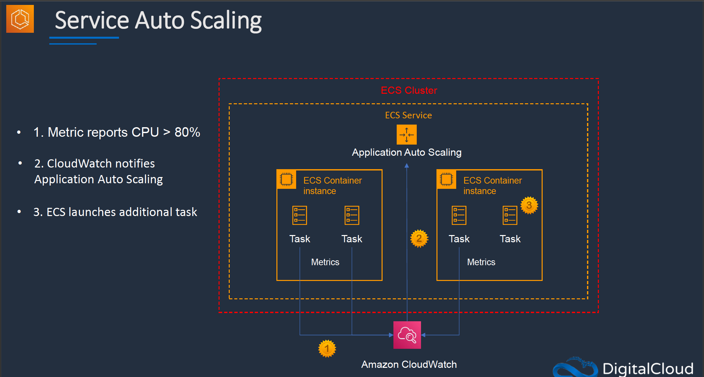
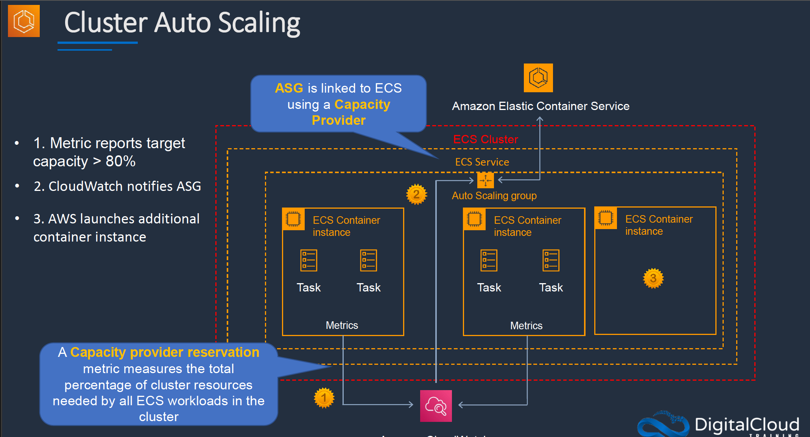
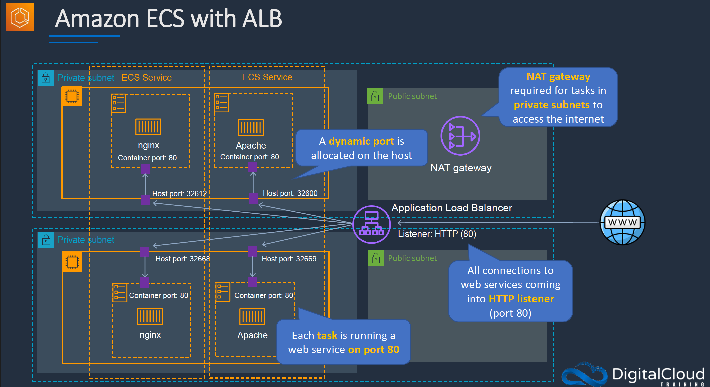
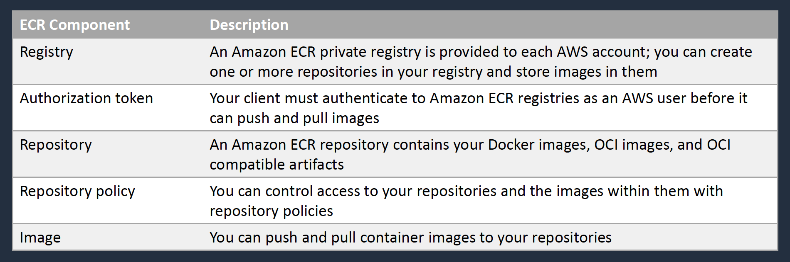

# Section 10: Containers on Amazon ECS/EKS

## Amazon Elastic Container Service (ECS)
__Amazon ECS Key Features__    
* __Serverless with AWS Fargate__ – managed for you and fully scalable
* __Fully managed container orchestration__ – control plane is managed for you
* __Docker support__ – run and manage Docker containers with integration into the Docker Compose CLI
* __Windows container support__ – ECS supports management of Windows containers
* __Elastic Load Balancing integration__ – distribute traffic across containers using ALB or NLB
* __Amazon ECS Anywhere (NEW)__ – enables the use of Amazon ECS control plane to manage on-premises implementations


__Amazon ECS Components__  

ECS Component      | Description
-------------------|---------------
Cluster            | Logical grouping of tasks or services
Container instance | EC2 instance running the the ECS agent
Task Definition    | Blueprint that describes how a docker container should launch
Task               | A running container using settings in a Task Definition
Service            | Defines long running tasks – can control task count with Auto Scaling and attach an ELB

__Amazon ECS Clusters__  
* ECS Clusters are a logical grouping of container instances that you can place tasks on
* A default cluster is created but you can then create multiple clusters to separate resources
* ECS allows the definition of a specified number (desired count) of tasks to run in the cluster
* Clusters can contain tasks using the Fargate and EC2 launch type
* EC2 launch type clusters can contain different container instance types
* Each container instance may only be part of one cluster at a time
* Clusters are region specific
* You can create IAM policies for your clusters to allow or restrict users' access to specific clusters

__ECS Container Instances and Container Agent__  
* You can use any AMI that meets the Amazon ECS AMI specification
* The EC2 instances used as container hosts must run an ECS agent
* The ECS container agent allows container instances to connect to the cluster
* The container agent runs on each infrastructure resource on an ECS cluster  

__Amazon ECS Images__  
* Containers are created from a read-only template called an __image__ which has the instructions for creating a Docker container
* Images are built from a __Dockerfile__
* Only Docker containers are supported on ECS
* Images are stored in a registry such as DockerHub or Amazon Elastic Container Registry (ECR)
* ECR is a managed AWS Docker registry service that is secure, scalable and reliable
* ECR supports private Docker repositories with resource-based permissions using AWS IAM in order to access repositories and images
* You can use the Docker CLI to push, pull and manage images

__Amazon ECS Tasks and Task Definitions__  
* A task definition is required to run Docker containers in Amazon ECS
* A task definition is a text file in JSON format that describes one or more containers, up to a maximum of 10
* Task definitions use Docker images to launch containers
* You specify the number of tasks to run (i.e. the number of containers)

__Task Definitions Parameters__  
Some of the parameters you can specify in a task definition include:
* Which Docker images to use with the containers in your task
* How much CPU and memory to use with each container
* Whether containers are linked together in a task
* The Docker networking mode to use for the containers in your task
* What (if any) ports from the container are mapped to the host container instances
* Whether the task should continue if the container finished or fails
* The commands the container should run when it is started
* Environment variables that should be passed to the container when it starts
* Data volumes that should be used with the containers in the task
* IAM role the task should use for permissions

### Amazon ECS Launch Types
__EC2 Launch Type__  
* Run containers on a cluster of Amazon EC2 instances that you manage
* You explicitly provision EC2 instances
* You’re responsible for managing EC2 instances
* Charged per running EC2 instance
* EFS and EBS integration
* You handle cluster optimization
* More granular control over infrastructure
* Registry: ECR, Docker Hub, Self-hosted

__Fargate Launch Type__  
* Run containers without the need to provision and manage the backend infrastructure
* AWS Fargate is the serverless way to host your Amazon ECS workloads
* Fargate automatically provisions resources
* Fargate provisions and manages compute
* Charged for running tasks
* No EBS integration
* Fargate handles cluster optimization
* Limited control, infrastructure is automated
* Registry: ECR, Docker Hub

__External Launch Type__   
* Run containers on your on-premises servers or virtual machines (VMs) – uses _Amazon ECS Anywhere_

### Amazon ECS and IAM Roles

### ECS Task Placement Strategies
__ECS Task Placement Strategies__   
* A task placement strategy is an algorithm for selecting instances for task placement or tasks for termination
* Task placement strategies can be specified when either running a task or creating a new service
* This is relevant only to the EC2 launch type
* Amazon ECS supports the following task placement strategies:
  - __binpack__ - places tasks on available candidates that have the least available amount of the resource (CPU or memory). This minimizes the number of instances in use
  - __random__ - place tasks randomly
  - __spread__ - place tasks evenly based on the specified value

__Placement Strategy - binpack__  
* The following strategy __bin packs__ tasks based on __memory__:
```json
"placementStrategy": [
  {
    "field": "memory",
    "type": "binpack"
  }
]
```

__Placement Strategies - Spread__  
* Accepted values are `instanceId` or `host` (same effect)
* Or any platform or custom attribute that is applied to a container instance, such as `attribute:ecs.availability-zone`
* Service tasks are spread based on the tasks from that service
* Standalone tasks are spread based on the tasks from the same task group
* The following strategy distributes tasks evenly across __Availability Zones__:
```json
"placementStrategy": [
  {
    "field": "attribute:ecs.availability-zone",
    "type": "spread"
  }
]
```
* The following strategy distributes tasks evenly across __all instances__:
```json
"placementStrategy": [
  {
    "field": "instanceId",
    "type": "spread"
  }
]
```

__Placement Strategy - binpack + spread__  
* The following strategy distributes tasks evenly across __Availability Zones__ and then __bin packs__ tasks based on __memory__ within each __Availability Zone__:  
```json
"placementStrategy": [
  {
    "field": "attribute:ecs.availability-zone",
    "type": "spread"
  },
  {
    "field": "memory",
    "type": "binpack"
  }
]
```

__Task Placement Contraint__  
* A task placement constraint is a rule that is considered during task placement
* Amazon ECS supports the following types of task placement constraints:
  - `distinctInstance` - Place each task on a different container instance
  - `memberOf` - Place tasks on container instances that satisfy an expression

__Cluster Query Language__  
* Cluster queries are expressions that enable you to group objects
* For example, you can group container instances by attributes such as __Availability Zone__, __instance type__, or __custom metadata__
* Expressions have the following syntax: subject operator [argument]
* __Example 1:__ The following expression selects instances with the specified instance type:
```sql
attribute:ecs.instance-type == t2.small
```
* __Example 2__: The following expression selects instances in the us-east-1a or us-east-1b Availability Zone:
```sql
attribute:ecs.availability-zone in [us-east-1a, us-east-1b]
```
* __Example 3__: The following expression selects instances that are hosting tasks in the `service:production` group:
```sql
task:group == service:production
```

### Scaling Amazon ECS
__Auto Scaling for ECS__  
Two types of scaling:
1. Service auto scaling
2. Cluster auto scaling

* __Service auto scaling__ automatically adjusts the desired task count up or down using the _Application Auto Scaling service_
* __Service auto scaling__ supports target tracking, step, and scheduled scaling policies
* __Cluster auto scaling__ uses a _Capacity Provider_ to scale the number of EC2 cluster instances using EC2 Auto Scaling

__How Service Auto Scaling Works__  
1. Metric reports CPU > 80%
2. CloudWatch notifies _Application Auto Scaling_
3. ECS launches additional task

__Service Auto Scaling - Scaling Policies__  
Amazon ECS Service Auto Scaling supports the following types of scaling policies:
* __Target Tracking Scaling Policies__ — Increase or decrease the number of tasks that your service runs based on a target value for a specific CloudWatch metric
* __Step Scaling Policies__ — Increase or decrease the number of tasks that your service runs in response to CloudWatch alarms. Step scaling is based on a set of scaling adjustments, known as step adjustments, which vary based on the size of the alarm breach
* __Scheduled Scaling__ — Increase or decrease the number of tasks that your service runs based on the date and time



__How Cluster Auto Scaling works__  
1. Metric reports target capacity > 80%
2. CloudWatch notifies ASG
3. AWS launches additional container instance

__Cluster Auto Scaling__   
* Uses an ECS resource type called a __Capacity Provider__
* A Capacity Provider can be associated with an EC2 __Auto Scaling Group__ (ASG)
* ASG can automatically scale using:
  - __Managed scaling__ - with an automatically-created scaling policy on your ASG
  - __Managed instance termination protection__ - which enables container-aware termination of instances in the ASG when scale-in happens



### Amazon ECS with ALB


### Amazon Elastic Container Registry (ECR)
__Amazon Elastic Container Registry (ECR)__  
* Amazon ECR is a fully-managed container registry
* Integrated with Amazon ECS and Amazon EKS
* Supports Open Container Initiative (OCI) and Docker Registry HTTP API V2 standards
* You can use Docker tools and Docker CLI commands such as `push`, `pull`, `list`, and `tag`
* Can be accessed from any Docker environment – in the cloud, on-premises, or on you machine
* Container images and artifacts are stored in S3
* You can use namespaces to organize repositories
* Public repositories allow everyone to access container images
* Access control applies to private repositories:
  - __IAM access control__ - Set policies to define access to container images in private repositories
  - __Resource-based policies__ - Access control down to the individual API action such as `create`, `list`, `describe`, `delete`, and `get`

__Amazon ECR Components__  


__Amazon ECR Features__  
* __Lifecycle policies__ - manage the lifecycle of the images in your repositories
* __Image scanning__ - identify software vulnerabilities in your container images
* __Cross-Region and cross-account replication__ – replicate images across accounts/Region
* __Pull through cache rules__ - cache repositories in remote public registries in your private Amazon ECR registry  

__Pushing an Image to a Private Repository__  
* Users must have an IAM permissions with the following policy defined in `push-image-policy.json`
* First, authenticate the Docker client to ECR:
```bash
$ aws ecr get-login-password --region <region> | docker login --username AWS --password-stdin <aws-ccount-id>.dkr.ecr.<region>.amazonaws.com
```
* Tag your image with the Amazon ECR registry, repository, and image tag name to use:
```bash
$ docker tag <image-id> <aws-ccount-id>.dkr.ecr.<region>.amazonaws.com/<repository-name>:<tag>
```
* Push the image using the docker push command:
```bash
$ docker push aws-ccount-id>.dkr.ecr.<region>.amazonaws.com/<repository-name>:<tag>
```

### Amazon Elastic Kubernetes Service (EKS)
__Introduction__  
* EKS is a managed service for running Kubernetes applications in the cloud or on-premises
* Kubernetes is an open-source system for automating deployment, scaling, and management of containerized applications
* Use when you need to __standardize__ container orchestration across multiple environments using a __managed Kubernetes__ implementation
* Features:
  - __Hybrid Deployment__ - manage Kubernetes clusters and applications across hybrid environments (AWS + On-premises)
  - __Batch Processing__ - run sequential or parallel batch workloads on your EKS cluster using the _Kubernetes Jobs API_. Plan, schedule and execute batch workloads
  - __Machine Learning__ - use _Kubeflow with EKS_ to model your machine learning workflows and efficiently run distributed training jobs using the latest EC2 GPU-powered instances, including Inferentia
  - __Web Applications__ - build web applications that automatically scale up and down and run in a highly available configuration across multiple Availability Zones

__Amazon EKS Auto Scaling__   
Workload Auto Scaling:
* __Vertical Pod Autoscaler__ - automatically adjusts the CPU and memory reservations for your pods to help "right size" your applications
* __Horizontal Pod Autoscaler__ - automatically scales the number of pods in a deployment, replication controller, or replica set based on that resource's CPU utilization

Cluster Auto Scaling:
* Amazon EKS supports two __autoscaling__ products:
  - Kubernetes Cluster Autoscaler
  - Karpenter open source autoscaling project
* The cluster autoscaler uses AWS scaling groups, while Karpenter works directly with the Amazon EC2 fleet

__Amazon EKS and Elastic Load Balancing__  
* Amazon EKS supports Network Load Balancers and Application Load Balancers
* The AWS Load Balancer Controller manages AWS Elastic Load Balancers for a Kubernetes cluster
* Install the AWS Load Balancer Controller using Helm V3 or later or by applying a Kubernetes manifest
* The controller provisions the following resources:
  - An AWS Application Load Balancer (ALB) when you create a Kubernetes Ingress
  - An AWS Network Load Balancer (NLB) when you create a Kubernetes service of type `LoadBalancer`
* In the past, the Kubernetes network load balancer was used for instance targets, but the AWS Load balancer Controller was used for IP targets
* With the AWS Load Balancer Controller version 2.3.0 or later, you can create NLBs using either target type

__Amazon EKS Distro__  
* Amazon EKS Distro is a distribution of Kubernetes with the same dependencies as Amazon EKS
* Allows you to manually run Kubernetes clusters anywhere
* EKS Distro includes binaries and containers of open-source Kubernetes, etcd, networking, and storage plugins, tested for compatibility
* You can securely access EKS Distro releases as open source on GitHub or within AWS via Amazon S3 and Amazon ECR
* Amazon EKS Distro alleviates the need to track updates, determine compatibility, and standardize on a common Kubernetes version across distributed teams
* You can create Amazon EKS Distro clusters in AWS on Amazon EC2 and on your own on-premises hardware using the tooling of your choice

__Amazon ECS and EKS Anywhere__  
* Run ECS or EKS on customer-managed infrastructure, supported by AWS
* Customers can run Amazon ECS/EKS Anywhere on their own on-premises infrastructure on bare metal servers
* You can also deploy _ECS/EKS Anywhere_ using VMware vSphere

## AWS Copilot
__Introduction__  
* Command line interface for launching and managing containers
* Used with ECS, Fargate, and AWS AppRunner
* Based on Infrastructure as Code (IaC) templates
* Simple commands to build containerized environments
```bash
# Build a copilot environment
$ copilot init
# Show information about environments and services
$ copilot app show
# Show information about environments
$ copilot env ls
# List of all the services in an application
$ copilot svc ls
# show service status
$ copilot svc status
```

__Copilot Setup__  
To install Copilot CLI on MacOS:
```bash
$ brew install aws/tap/copilot-cli
$ copilot --version
```

__Copilot Vs ECS CLI__  
Copilot was launch in 2020.  
It is the successor of ECS CLI which was launched in 2017 and deprecated in 2022.   
All new application should be done with `Copilot` and not `ECS CLI`.   

__Learn more about Copilot__  
* [AWS Copilot](https://aws.amazon.com/containers/copilot/)  
* [AWS Copilot CLI](https://aws.github.io/copilot-cli/)   
