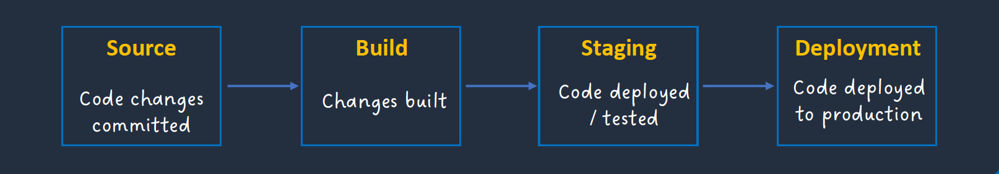
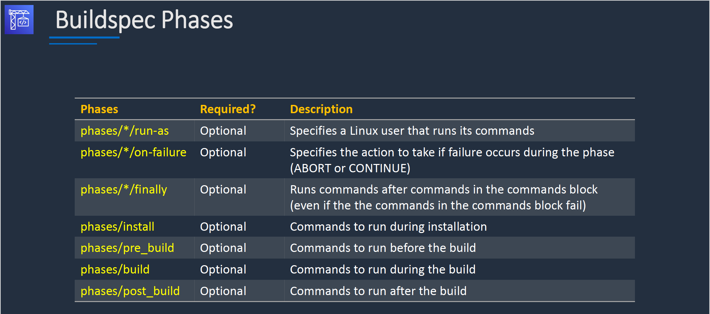

# Section 11: AWS Developer Tools (CI/CD)

## CI/CD Overview

__Continuous Integration (CI)__  
* Developers frequently merge code into a shared repository
* Each merge triggers automated builds and tests to catch issues early
* Helps detect integration problems sooner rather than later

__Continuous Delivery (CD)__  
* Ensures that code is always in a deployable state after passing automated tests
* After passing tests, code must be manually approved before deployment to production or staging
* Automates everything except the final release step
* Allows teams to decide when to deploy rather than deploying automatically

__Continuous Deployment (CD)__  
* Fully automates deployment to production without manual approval
* Every successful change that passes tests is automatically released
* Requires a high level of automation and confidence in testing
* Best suited for teams that need rapid updates with minimal risk

## Git and GitHub

## AWS CodePipeline
__AWS CodePipeline Overview__  
* Fully managed continuous delivery service you can use to __model__, __visualize__, and automate the steps required to release software in CI/CD  
* CodePipeline automates the __build__, __test__, and __deploy__ phases of your release process every time there is a code change, based on the release model you define

__AWS CodePipeline Integrations__  
AWS CodePipeline provides tooling integrations for many AWS and third-party software at each stage of the pipeline including:
* __Source stage__ – S3, ECR, Github, GitLab, Bitbucket etc.
* __Build__ – Run shell commands or use AWS CodeBuild, ECR, or Jenkins
* __Test__ – CodeBuild, Device Farm, Jenkins, Ghost Inspector UI Testing, Micro Focus StormRunner Load, Runscope API monitoring
* __Deploy stage__ – AppConfig, CloudFormation, CodeDeploy, ECS, Elastic Beanstalk, AWS Service Catalog, S3, Alexa Skills Kit

#### AWS CodePipeline Concepts  
__Pipelines__  
* A workflow that describes how software changes go through the release process
* Each pipeline is made up of a series of stages
* There are two types of pipeline:
  - V1 type pipelines have a JSON structure that contains standard pipeline, stage, and action-level parameters
  - V2 type pipelines have the same structure as a V1 type, along with additional parameters for release safety and trigger configuration

__Artifacts__   
* Files or changes that will be worked on by the actions and stages in the pipeline
* Each pipeline stage can create "artifacts"
* Artifacts are passed, stored in Amazon S3 and then passed on to the next stage
* Examples include application source code, built applications, dependencies, definitions files, and templates

__Stages__   
* Pipelines are broken up into stages
* Each stage can have sequential actions and/or parallel actions
* Stage examples would be source, build, test, deploy, load test etc.
* Manual approval can be defined at any stage

__Actions__  
* Stages contain at least one action
* For example, a source action from a code change, or an action for deploying the application to instances
* Actions affect artifacts and will have artifacts as either an input, and output, or both

__Transitions__
* The progression from one stage to another inside of a pipeline

__Pipeline executions__  
* An execution is a set of changes released by a pipeline. Each pipeline execution is unique and has its own ID
* An execution corresponds to a set of changes, such as a merged commit or a manual release of the latest commit
* Two executions can release the same set of changes at different times

## AWS CodeBuild
__Introduction__  
* AWS CodeBuild is a fully managed continuous integration (CI) service
* It compiles source code, runs tests, and produces software packages that are ready to deploy
* CodeBuild launches a temporary containerized environment based on a specified build image (Docker image)
* The build steps are executed based on the instructions in the `buildspec.yml` file
* CodeBuild scales continuously and processes multiple builds concurrently
* You pay based on the time it takes to complete the builds
* CodeBuild takes source code from GitHub, Bitbucket, CodePipeline, S3 etc.
* Build instructions can be defined in the code (`buildspec.yml`)
* Output logs can be sent to Amazon S3 & Amazon CloudWatch Logs

__AWS CodeBuild Components__  
1. __Build project__ - defines how CodeBuild will run a build defines settings including:
  - Location of the source code
  - The build environment to use
  - The build commands to run
  - Where to store the output of the build
2. __Build environment__ - the operating system, language runtime, and tools that CodeBuild uses for the build
3. __Build Specification__ - a YAML file that describes the collection of commands and settings for CodeBuild to run a build

__Buildspec Phases__   

## AWS CodeDeploy
__Introduction__  
* CodeDeploy is a deployment service that automates application deployments
* Deploys to Amazon EC2 instances, on-premises instances, serverless Lambda functions, and Amazon ECS
* You can deploy a nearly unlimited variety of application content, including:
  - Serverless AWS Lambda functions
  - Web and configuration files
  - Executables
  - Packages
  - Scripts
  - Multimedia files
* An AWS CodeDeploy application contains information about what to deploy and how to deploy it
* Need to choose the compute platform:
  - EC2/On-premises
  - AWS Lambda
  - Amazon ECS

#### CodeDeploy compute platforms
__EC2/On-Premises:__
* Amazon EC2, on-premises servers, or both
* Traffic is directed using an __in-place__ or __blue/green__ deployment type

__AWS Lambda:__  
* Used to deploy applications that consist of an updated version of a Lambda function
* You can manage the way in which traffic is shifted to the updated Lambda function versions during a deployment by choosing a __canary__, __linear__, or __all-at-once__ configuration

__Amazon ECS:__
* Used to deploy an Amazon ECS containerized application as a task set
* CodeDeploy performs a __blue/green__ deployment by installing an updated version of the application as a new replacement task set
* CodeDeploy re-routes production traffic from the original application task set to the replacement task set
* The original task set is terminated after a successful deployment
* You can manage the way in which traffic is shifted to the updated task set during a deployment by choosing a __canary__, __linear__, or __all-at-once__ configuration

__In place deployment__  
With _in-place_ deployment, the application or instance is taken out of action while the update is being applied, and then it will be back up and running again after the update is completed.  This mean downtime.  

__Blue green deployment__  
With _blue-green_ deployment, the update is deployed to a new target group or instance, and after the update is complete, the original target group or instance is terminated.

__Blue/Green Traffic Shifting__  
* __AWS Lambda:__ Traffic is shifted from one version of a Lambda function to a new version of the same Lambda function
* __Amazon ECS:__ Traffic is shifted from a task set in your Amazon ECS service to an updated, replacement task set in the same Amazon ECS service
* __EC2/On-Premises:__ Traffic is shifted from one set of instances in the original environment to a replacement set of instances
* _Note:_ All AWS Lambda and Amazon ECS deployments are blue/green. An EC2/On-Premises deployment can be in-place or blue/green

__For Amazon ECS and AWS Lambda there are three ways traffic can be shifted during a deployment:__
* __Canary__ - Traffic is shifted in two increments. You can choose from predefined canary options that specify the percentage of traffic shifted to your updated Amazon ECS task set / Lambda function in the first increment and the interval, in minutes, before the remaining traffic is shifted in the second increment
* __Linear__ - Traffic is shifted in equal increments with an equal number of minutes between each increment. You can choose from predefined linear options that specify the percentage of traffic shifted in each increment and the number of minutes between each increment
* __All-at-once__ - All traffic is shifted from the original Amazon ECS task set / Lambda function to the updated Amazon ECS task set / Lambda function all at once

## AWS CodeStar
__Introduction__  
* AWS CodeStar enables you to quickly develop, build, and deploy applications on AWS
* It is a pre-configured continuous delivery toolchain for developing, building, testing, and deploying
* Use project templates to develop applications on services such as:
  - Amazon EC2
  - AWS Lambda
  - Elastic Beanstalk
* You can use code editors such as Visual Studio, Eclipse or the AWS CLI
* Uses IAM to manage developer identities
* Built-in role-based policies for secure team access
* Share projects with three access levels:
  - Owners
  - Contributors
  - Viewers
* Application code is stored in CodeCommit
* Compiles and packages source code with CodeBuild
* A pre-configured pipeline is used through CodePipeline
* Automated deployments with CodeDeploy and CloudFormation

## AWS Amplify and AppSync
__AWS Amplify__  
* Tools and features for building full-stack applications on AWS
* Build web and mobile backends, and web frontend UIs
* AWS Amplify Studio is a visual interface for building web and mobile apps:
  - Use the visual interface to define a data model, user authentication, and file storage without backend expertise
  - Easily add AWS services not available within Amplify Studio using the AWS Cloud Development Kit (CDK)
  - Connect mobile and web apps using Amplify Libraries for iOS, Android, Flutter, React Native, and web (JavaScript)
* AWS Amplify Hosting is a fully managed CI/CD and hosting service for fast, secure, and reliable static and server-side rendered apps

__AWS AppSync__  
* AWS AppSync is a fully managed service that makes it easy to develop GraphQL APIs
* Applications can securely access, manipulate, and receive real-time updates from multiple data sources such as databases or APIs
* AWS AppSync automatically scales a GraphQL API execution engine up and down to meet API request volumes
* Uses GraphQL, a data language that enables client apps to fetch, change and subscribe to data from servers
* AWS AppSync lets you specify which portions of your data should be available in a real-time manner using GraphQL Subscriptions
* AWS AppSync supports AWS Lambda, Amazon DynamoDB, and Amazon Elasticsearch
* Server-side data caching capabilities reduce the need to directly access data sources
* AppSync is fully managed and eliminates the operational overhead of managing cache clusters
