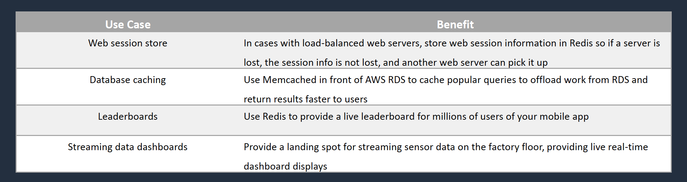

# Databases and Analytics
## Amazon Aurora

__Introduction__  
* Amazon Aurora is an AWS database offering in the RDS family
* Amazon Aurora is a MySQL and PostgreSQL-compatible relational database built for the cloud
* Amazon Aurora is up to _five times_ faster than standard MySQL databases and _three times_ faster than standard PostgreSQL databases
* Amazon Aurora features a distributed, fault-tolerant, self-healing storage system that auto-scales up to 128TB per database instance

__Aurora Fault Tolerance and Aurora Replicas__  
* Fault tolerance across 3 AZs
* Single logical volume
* Aurora Replicas scale-out read requests
* Up to 15 Aurora Replicas with sub-10ms replica lag
* Aurora Replicas are independent endpoints
* Can promote Aurora Replica to be a new primary or create new primary
* Set priority (tiers) on Aurora Replicas to control order of promotion
* Can use Auto Scaling to add replicas

__Amazon Aurora Key Features__  

__Amazon Aurora Replicas__  

__Amazon ElasticCache__  
  

__Amazon ElastiCache Examples__  

## Amazon MemoryDB for Redis
__Introduction__  
* Redis-compatible, durable, in-memory database service that delivers ultra-fast performance
* Entire dataset is stored in memory – entire DB solution
* Purpose-built for modern applications with microservices architectures
* Build applications using the same flexible and friendly Redis data structures, APIs, and commands
* Microsecond read and single-digit millisecond write latency and high throughput
* Data stored durably across multiple AZs using a distributed transactional log
* Supports write scaling with sharding and read scaling by adding replicas

__MemoryDB for Redis vs ElastiCache__  
* Use ElastiCache for caching DB queries
* Use MemoryDB for a full DB solution combining DB and cache
* MemoryDB offers higher performance with lower latency
* MemoryDB offers strong consistency for primary nodes and eventual consistency for replica nodes
* With ElastiCache there can be some inconsistency and latency depending on the engine and caching strategy

## Amazon Kinesis Core Knowledge
__Amazon Kinesis Data Streams__  
* Producers send data to Kinesis, data is stored in Shards
for 24 hours (by default, up to 7 days)
* Consumers then take the data and process it - data can
then be saved into another AWS service
* Real time (~200ms)

__Kinesis Client Library (KCL)__  
* The Kinesis Client Library (KCL) helps you consume and process data from a Kinesis data stream
* KCL enumerates shards and instantiates a record processor for each shard it manages
* Each shard is processed by exactly one KCL worker and has exactly one corresponding record processor
* One worker can process any number of shards, so it's fine if the number of shards exceeds the number of instances

__Kinesis Data Firehose__  
* Producers send data to Firehose
* There are no Shards, completely automated (scalability is elastic)
* Firehose data is sent to another AWS service for storing, data can be
optionally processed/transformed using AWS Lambda
* Near real-time delivery (~60 seconds latency)

__Kinesis Data Firehose destinations__  
* RedShift (via an intermediate S3 bucket)
* Elasticsearch
* Amazon S3
* Splunk
* Datadog
* MongoDB
* New Relic
* HTTP Endpoint

__Kinesis Data Analytics__  
* Provides real-time SQL processing for streaming data
* Provides analytics for data coming in from Kinesis Data Streams and Kinesis Data Firehose
* Destinations can be Kinesis Data Streams, Kinesis Data Firehose, or AWS Lambda

### Amazon Kinesis Client Library (KCL)
__Amazon Kinesis Client Library (KCL)__  
* The Kinesis Client Library (KCL) helps you consume and process data from a Kinesis data stream
* The KCL is different from the _Kinesis Data Streams API_ that is available in the AWS SDKs
* The Kinesis Data Streams API helps you manage many aspects of Kinesis Data Streams (including creating streams, resharding, and putting and getting records)
* The KCL provides a layer of abstraction specifically for processing data in a consumer role
* Each shard is processed by exactly one KCL worker and has exactly one corresponding record processor, so you never need multiple instances to process one shard
* However, one worker can process any number of shards, so it's fine if the number of shards exceeds the number of instances

## Amazon OpenSearch Service (Elasticsearch)
__Introduction__  
* Distributed search and analytics suite
* Based on the popular open source Elasticsearch
* Supports queries using SQL syntax
* Integrates with open-source tools
* Scale by adding or removing instances
* Availability in up to three Availability Zones
* Backup using snapshots
* Encryption at-rest and in-transit

__OpenSearch Service Deployment__  
* Clusters are created (Management Console, API, or CLI)
* Clusters are also known as OpenSearch Service domains
* You specify the number of instances and instance types
* Storage options include UltraWarm or Cold storage

__OpenSearch in an Amazon VPC__
* Clusters can be deployed in a VPC for secure intra-VPC communications
* VPN or proxy required to connect from the internet (public domains are directly accessible)
* Cannot use IP-based access policies
• Limitations of VPC deployments:
  - You can’t switch from VPC to a public endpoint. The reverse is also true
  - You can’t launch your domain within a VPC that uses dedicated tenancy
  - After you place a domain within a VPC, you can’t move it to a different VPC, but you can change the subnets and security group settings

__The ELK Stack__   
* ELK stands for _Elasticsearch_, _Logstash_, and _Kibana_
* This is a popular combination of projects
* Aggregate logs from systems and applications, analyze these logs, and create visualizations
* Use cases include:
  - Visualizing application and infrastructure monitoring data
  - Troubleshooting
  - Security analytics

__OpenSearch Access Control__  
* __Resource-based policies__ – often called a domain access policy
* __Identity-based policies__ – attached to users or roles (principals)
* __IP-based policies__ – Restrict access to one or more IP addresses or CIDR blocks
* __Fine-grained access control__ – Provides:
  - Role-based access control
  - Security at the index, document, and field level
  - OpenSearch Dashboards multi-tenancy
  - HTTP basic authentication for OpenSearch and OpenSearch Dashboards
* Authentication options include:
  - Federation using SAML to on-premises directories
  - Amazon Cognito and social identity providers

__OpenSearch Best Practices__  
* Deploy OpenSearch data instances across three Availability Zones (AZs) for the best availability
* Provision instances in multiples of three for equal distribution across AZs
* If three AZs are not available use two AZs with equal numbers of instances
* Use three dedicated master nodes
* Configure at least one replica for each index
* Apply restrictive resource-based access policies to the domain (or use fine-grained access control)
* Create the domain within an Amazon VPC
* For sensitive data enable node-to-node encryption and encryption at rest

## Amazon Athena and AWS Glue
__Amazon Athena__  
* Athena queries data in S3 using SQL
* Can be connected to other data sources with Lambda
* Data can be in CSV, TSV, JSON, Parquet and ORC formats
* Uses a managed Data Catalog (AWS Glue) to store information and schemas about the databases and tables

__Optimizing Athena for Performance___  
* Partition your data
* Bucket your data – bucket the data within a single partition
* Use Compression – AWS recommend using either Apache Parquet or Apache ORC
* Optimize file sizes
* Optimize columnar data store generation – Apache Parquet and Apache ORC are popular columnar data stores
* Optimize ORDER BY and Optimize GROUP BY
* Use approximate functions
* Only include the columns that you need

__AWS Glue__  
* Fully managed extract, transform and load (ETL) service
* Used for preparing data for analytics
* AWS Glue runs the ETL jobs on a fully managed, scale-out Apache Spark environment
* AWS Glue discovers data and stores the associated metadata (e.g. table definition and schema) in the AWS Glue Data Catalog
* Works with data lakes (e.g. data on S3), data warehouses (including RedShift), and data stores (including RDS or EC2 databases)
* You can use a crawler to populate the AWS Glue Data Catalog with tables
* A crawler can crawl multiple data stores in a single run
* Upon completion, the crawler creates or updates one or more tables in your Data Catalog.
* ETL jobs that you define in AWS Glue use the Data Catalog tables as sources and targets
