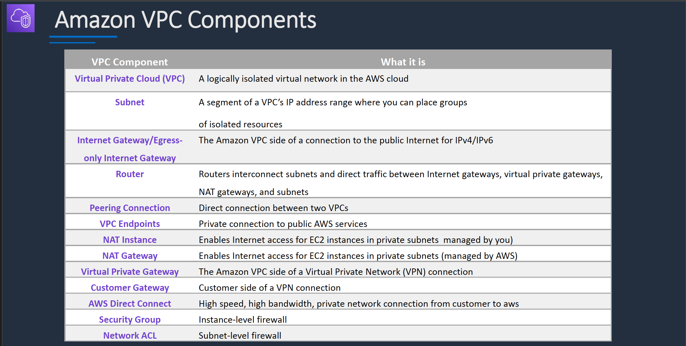
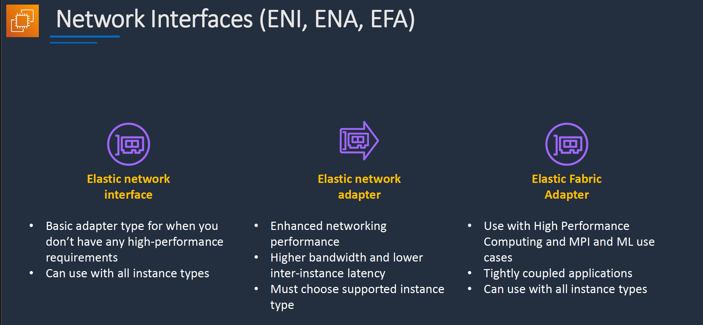
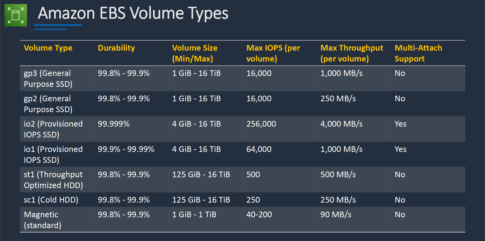
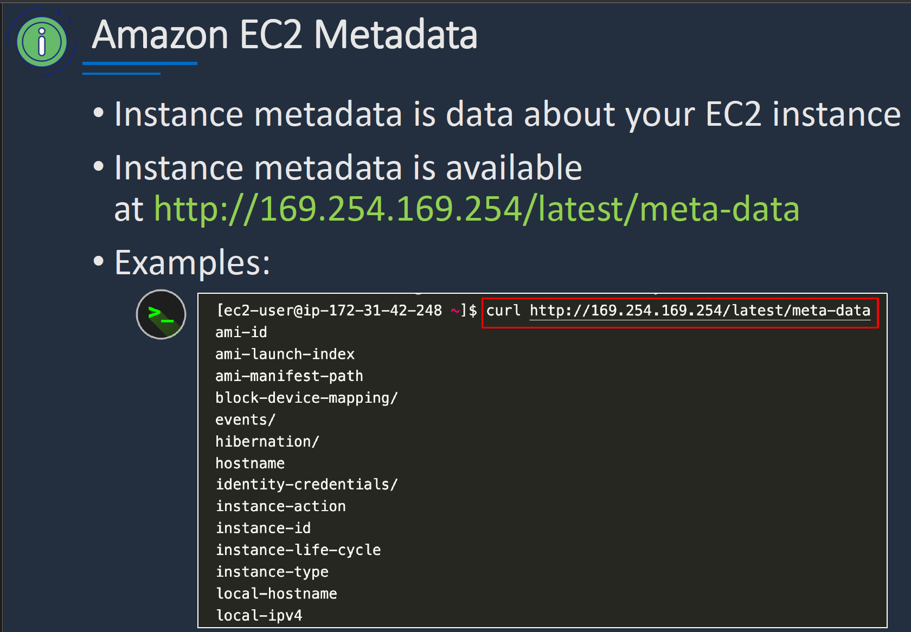
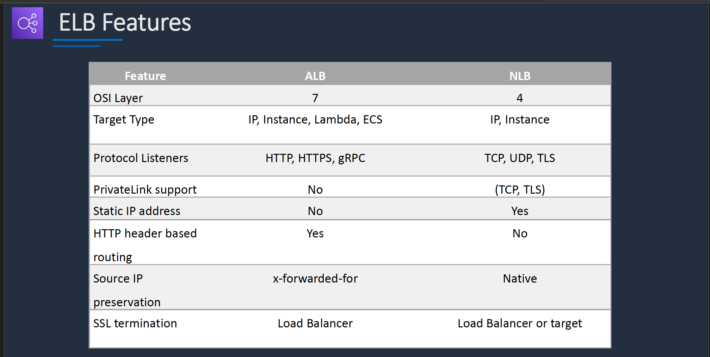

# Section 4: Amazon VPC, EC2 and ELB

## Amazon VPC
__Introduction__  

__Amazon Elastic Compute Cloud (EC2)__  
* EC2 instances running on MacOS always required a dedicated hardware

__Amazon VPC Core Knowledge__  
* By default you can create up to 5 VPCs per region

__Elastic Network Interface (ENI)__  
* An EC2 instance can be connected to two ENI in different subnets as long as they are in the same availability zone.  
* For example `eth0` can be in a private subnet and `eth1` can be in a public subnet in the same availability zone and both of them can be attached an EC2 instance in the same availability zone.  

__Network Interfaces (ENI, ENA, EFA)__  

__Amazon EBS Volume Types__  

__EBS Volume Use cases__  
* __gp3 (General Purpose SSD)__ – Most workloads, including databases and dev/test environments
* __gp2 (General Purpose SSD)__ – Boot volumes, dev/test, general workloads
* __io2 (Provisioned IOPS SSD)__ – High-performance databases, critical applications
* __io1 (Provisioned IOPS SSD)__ – Databases requiring high IOPS
* __st1 (Throughput Optimized HDD)__ – Streaming, big data, log processing
* __sc1 (Cold HDD)__ – Archival storage, infrequent access workloads
* __Magnetic (standard)__ – Legacy workloads, small boot volumes

__Custom VPC__  
* Note that any subnet that is not explicitly associated with a Route table will be implicitly associated with the default route table which route every outgoing traffic to the Internet gateway.  

__Amazon EC2 Metadata__  

## Elastic Load Balancer
#### Types of Elastic Load Balancer (ELB)
__Application Load Balancer__  
* Operates at the request level
* Routes based on the content of the request (layer 7)
* Supports path-based routing, host-based routing, query string parameter-based routing, and source IP address-based routing
* Supports instances, IP addresses, Lambda functions and containers as targets

__Network Load Balancer__  
* Operates at the connection level
* Routes connections based on IP protocol data (layer 4)
* Offers ultra high performance, low latency and TLS offloading at scale
* Can have a static IP / Elastic IP
* Supports UDP and static IP addresses as targets

__Gateway Load Balancer__  
* Used in front of virtual appliances such as firewalls, IDS/IPS, and deep packet inspection systems.
* Operates at Layer 3 – listens for all packets on all ports
* Forwards traffic to the TG specified in the listener rules
* Exchanges traffic with appliances using the GENEVE protocol on port 6081

__Classsic Load Balancer__  
* Old generation; not recommended for new applications
* Performs routing at Layer 4 and Layer 7
* Use for existing applications running in EC2-Classic

__ELB Features__
  

__ELB Use Cases__  
Application Load Balancer
* Web applications with L7 routing (HTTP/HTTPS)
* Microservices architectures (e.g. Docker containers)
* Lambda targets

Network Load Balancer
* TCP and UDP based applications
* Ultra-low latency
* Static IP addresses
* VPC endpoint services

Gateway Load Balancer
* Load balance virtual appliances such as:
  - Intrusion detection systems (IDS)
  - Intrusion prevention systems (IPS)
  - Next generation firewalls (NGFW)
  - Web application firewalls (WAF)
  - Distributed denial of service protection systems (DDoS)
* Integrate with Auto Scaling groups for elasticity
* Apply network monitoring and logging for analytics
