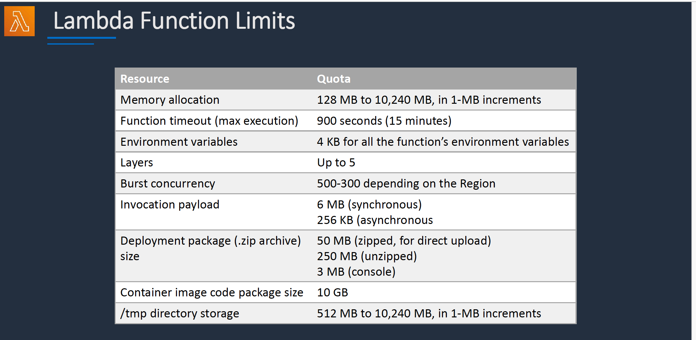

# Section 7: AWS Lambda and AWS SAM  
## Lambda Function
__Lambda Function Invocation__  
__Synchronous:__
* CLI, SDK, API Gateway
* Wait for the function to process the event and return a response
* Error handling happens client side (retries, exponential backoff etc)

__Asynchronous:__
* S3, SNS, CloudWatch Events etc
* Event is queued for processing and a response is returned immediately
* Lambda retries up to 3 times
* Processing must be idempotent (due to retries)

__Event source mapping:__  
* SQS, Kinensis Data Stream, DynamoDB Streams
* Lambda does the polling (pools the source)

__Lambda Function Concurrency__  
If concurrency limit is exceeded throttling occurs with error _"Rate exceeded"_ and a 429 "TooManyRequestsException" .

__Lambda Function Limits__  


### Lambda Invocation
__Lambda API Invocation__  
You can invoke a REST API Lambda code behind an API gateway to simulate a HTTP request:
```bash
$ cd scripts
$ ./lambda-invoke-api.sh FunctionName api-payload-login.json output-1.json
```
Checkout the `output-1.json` for the result.

__Logs and Tail__  
You can use the `--log-type Tail` option to get the logs from your Lambda invocation
```bash
$ aws lambda invoke --function-name FunctionName --log-type Tail output2.json > response.json
```
You will find the log result in the `LogResult` property in the `response.json` file.  
The `LogResult` value is Base64 encoded and has to be decoded.     
You can use the `decode-base64.sh` script to decode the Base64 encoded log.
Alternatively, you can run the `lambda-logs-v2.sh` script to have the log decoded automatically at invocation time:  
```bash
$ cd scripts
$ ./lambda-logs-v2.sh FunctionName
```

__Success and Failure Destinations__  
* Send invocation records to a destination when your function is invoked
* Works for asynchronous invocations and Stream invocations (Kinesis/DynamoDB stream)
* Choose the condition as success of failure
* Destination type is SQS queue, SNS topic, Lambda function, or EventBridge event bus
* The execution record contains details about the request and response in JSON format
* Information sent includes:
  - Version
  - Timestamp
  - Request context
  - Request payload
  - Response context
  - Response payload

__Dead-Letter Queue (DLQ)__
* A DLQ saves unprocessed events for further processing
* Applies to asynchronous invocations
* The DLQ can be an Amazon SQS queue or an Amazon SNS topic
* When editing the asynchronous configuration, you can specify the number of retries:
  - Lambda will retry processing up to 2 times.
  - After 6 hours the event is discarded and can be sent to a DLQ
