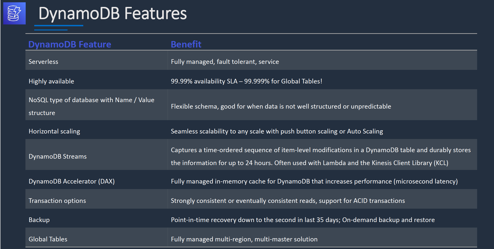
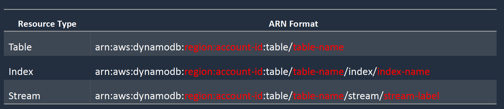
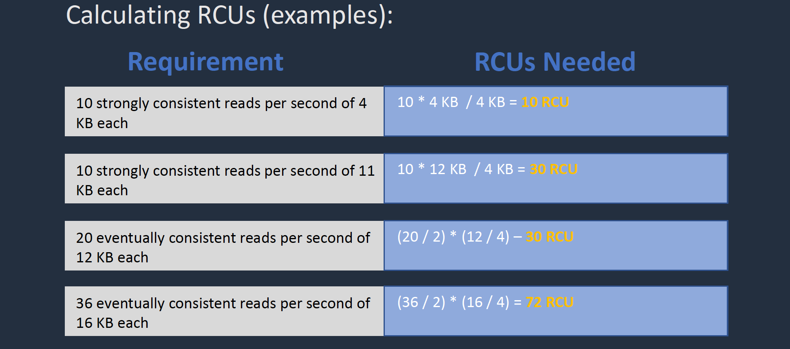
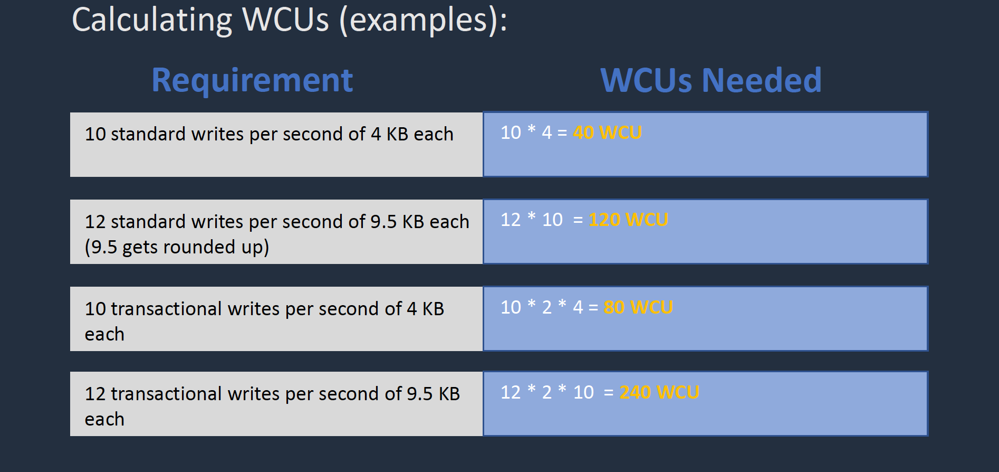

# Section 8: Amazon DynamoDB
__Introduction__  
* Can store key/value and document data types
* Push button scaling
* DynamoDB provides low latency (milliseconds)
*Microsecond latency can be achieved with DynamoDB Accelerator (DAX)
* All data is stored on SSD storage
* Data is replicated across multiple AZs in a Region
* DynamoDB Global Tables synchronizes tables across Regions

__DynamoDB Features__  


__DynamoDB API__  
* API operations are categorized as _control plane_ or _data plane_  
* Example _control plane_ API actions:
  - `CreateTable` – Creates a new table
  - `DescribeTable` – Returns information about a table, such as its primary key schema, throughput settings, and index information
  - `ListTables` – Returns the names of all your tables in a list
  - `UpdateTable` – Modifies the settings of a table or its indexes
  - `DeleteTable` – Removes a table and all its dependent objects from DynamoDB
* Data plane API actions can be performed using _PartiQL (SQL compatible)_, or classic DynamoDB CRUD APIs
* Example data plane API actions (DynamoDB CRUD ):
  - `PutItem` – Writes a single item to a table
  - `BatchWriteItem` – Writes up to 25 items to a table
  - `GetItem` – Retrieves a single item from a table
  - `BatchGetItem` – Retrieves up to 100 items from one or more tables
  - `UpdateItem` – Modifies one or more attributes in an item
  - `DeleteItem` – Deletes a single item from a table

__DynamoDB Supported Data Types__  
* DynamoDB supports many data types
* They can be categorized as follows:
  - `Scalar Types` – A scalar type can represent exactly one value. The scalar types are number, string, binary, Boolean, and null
  - `Document Types` – A document type can represent a complex structure with nested attributes, such as you would find in a JSON document. The document types are list and map
  - `Set Types` – A set type can represent multiple scalar values. The set types are string set, number set, and binary set

__DynamoDB Table Classes__  
1. __DynamoDB Standard__ – default and recommended for most workloads
2. __DynamoDB Standard-Infrequent Access (DynamoDB Standard-IA)__ Lower cost storage for tables that store
infrequently accessed data, such as:
  - Application logs
  - Old social media posts
  - E-commerce order history
  - Past gaming achievements

__DynamoDB Access Control__  
* All authentication and access control is managed using IAM
* DynamoDB supports `identity-based` policies:
  - Attach a permissions policy to a user or a group in your account
  - Attach a permissions policy to a role (grant cross-account permissions)
* DynamoDB supports `resource-based` policies for tables, indexes, and streams:
  - Specify access for IAM principals to perform specific actions on these DynamoDB resources
  - The maximum size of a resource-based policy attached to a DynamoDB resource is _20KB_
* The primary DynamoDB resources are tables
* Also supports additional resource types such as indexes, and streams
* You can create indexes and streams only in the context of an existing DynamoDB table (subresources)
* These resources and subresources have unique ARNs associated with them, as shown in the following table:


### DynamoDB Partitions and Primary Keys
__DynamoDB Partitions and Primary Keys__  
* Amazon DynamoDB stores data in partitions
* A partition is an allocation of storage for a table that is automatically replicated across multiple AZs within an AWS Region
* DynamoDB manages partitions for you
* DynamoDB allocates sufficient partitions to support provisioned throughput requirements
* DynamoDB allocates additional partitions to a table in the following situations:
  - If you increase the table's provisioned throughput settings beyond what the existing partitions can support
  - If an existing partition fills to capacity and more storage space is required

__Type of Primary Key__  
There are two types of Primary key:   
1. __Partition keys__ - unique attribute (e.g. user ID)
2. __Composite keys__ -  Partition key + Sort key in combination

__Partition key__
* Unique attribute (e.g. user ID)
* Value of the Partition key is input to an internal hash function which determines the partition or physical location on which the data is stored
* If you are using the Partition key as your Primary key, then no two items can have the same partition key

__Composite key__
* Partition key + Sort key in combination
* Example is user posting to a forum. Partition key would be the user ID, Sort key would be the timestamp of the post
* 2 items may have the same Partition key, but they must have a different Sort key
* All items with the same Partition key are stored together, then sorted according to the Sort key value
* Allows you to store multiple items with the same partition key

__Read and Write Capacity Unit__  
* DynamoDB evenly distributes provisioned throughput—read capacity units (RCUs) and write capacity units (WCUs) among partitions
* If your access pattern exceeds __3000 RCU__ or __1000 WCU__ for a single partition key value, your requests might be throttled
* Reading or writing above the limit can be caused by these issues:
  - Uneven distribution of data due to the wrong choice of partition key
  - Frequent access of the same key in a partition (the most popular item, also known as a hot key)
  - A request rate greater than the provisioned throughput

__Best practices for partition keys__  
* Use __high-cardinality__ attributes – e.g. e-mailid, employee_no, customerid, sessionid, orderid, and so on
* Use __composite attributes__ – e.g. `customerid+productid+countrycode` as the partition key and order_date as the sort key
* __Cache__ popular items – use DynamoDB accelerator (DAX) for caching reads
* Add random numbers or digits from a predetermined range for write-heavy use cases
* For example, add a random suffix to an invoice number such as INV00023-04593

### DynamoDB Consistency Models and Transactions
__DynamoDB Consistency Models__  
* DynamoDB supports __eventually consistent__ and __strongly consistent__ reads
* __Eventually consistent reads__:
  -  When you read data from a DynamoDB table, the response might not reflect the results of a recently completed write operation
  - The response might include some stale data
  - If you repeat your read request after a short time, the response should return the latest data
* __Strongly consistent read__:
  - DynamoDB returns a response with the most up-to-date data, reflecting the updates from all prior write operations that were successful
  - A strongly consistent read might not be available if there is a network delay or outage. In this case, DynamoDB may return a server error (HTTP 500)
  - Strongly consistent reads may have higher latency than eventually consistent reads
  - Strongly consistent reads are not supported on global secondary indexes
  - Strongly consistent reads use more throughput capacity than eventually consistent reads
* With a __strongly consistent__ read, data will always be returned when reading after a successful write
* DynamoDB uses eventually consistent reads by default
* You can configure strongly consistent reads with the `GetItem`, `Query` and `Scan` APIs by setting the `--consistent-read` (or `ConsistentRead`) parameter to `true`

__DynamoDB Transactions__   
* With DynamoDB transactions DynamoDB makes coordinated, all-or-nothing changes to multiple items both within and across tables
* Transactions provide _Atomicity, Consistency, Isolation, and Durability_ (ACID) in DynamoDB
* Enables reading and writing of multiple items across multiple tables as an all or nothing operation
* Checks for a pre-requisite condition before writing to a table
* There is no additional cost to enable transactions for DynamoDB tables
* You pay only for the reads or writes that are part of your transaction
* DynamoDB performs `two` underlying `reads` or `writes` of every item in the transaction: one to prepare the transaction and one to commit the transaction

__DynamoDB Transaction Write API__  
* With the transaction write API, you can group multiple `Put`, `Update`, `Delete`, and `ConditionCheck` actions
* You can then submit the actions as a single `TransactWriteItems` operation that either succeeds or fails as a unit
* The same is true for multiple `Get` actions, which you can group and submit as a single `TransactGetItems` operation

### DynamoDB Capacity Units (RCU/WCU)
__DynamoDB Provisioned Capacity__  
* Provisioned capacity is the default setting
* You specify the reads and write per second
* Can enabled auto scaling for dynamic adjustments
* Capacity is specified using:
  - Read Capacity Units (RCUs)
  - Write Capacity Units (WCUs)

__Read Capacity Units (RCUs)__  
* Each API call to read data from your table is a read request
* Read requests can be strongly consistent, eventually consistent, or transactional
* For items up to `4 KB` in size, one RCU equals:
  - One strongly consistent read request per second
  - Two eventually consistent read requests per second
  - 0.5 transactional read requests per second
* Items larger than 4 KB require additional RCUs

__Calculating RCU__  


__Write Capacity Units (WCUs)__  
* Each API call to write data to your table is a write request
* For items up to 1 KB in size, one WCU can perform:
  - One standard write request per second
  - 0.5 transactional writes requests (one transactional write requires two WCUs)
* Items larger than 1 KB require additional WCUs

__Calculating WCU__  


__DynamoDB On-Demand Capacity__  
* With on-demand, you don't need to specify your requirements
* DynamoDB instantly scales up and down based on the activity of your application
* Great for unpredictable / spikey workloads or new workloads that aren't well understood
* You pay for what you use (pay per request)

### DynamoDB Performance and Throttling
__DynamoDB Performance and Throttling__   
* Throttling occurs when the configured RCU or WCU are exceeded
* You may receive the following error: `ProvisionedThroughputExceededException`
* This error indicates that the request rate is too high for the read / write capacity provisioned for the table
* The AWS SDKs for DynamoDB automatically retry requests that receive this exception
* The request is eventually successful, unless the retry queue is too large to finish

Possible causes of performance issues
* __Hot keys__ – one partition key is being read too often
* __Hot partitions__ - when data access is imbalanced, a "hot" partition can receive a higher volume of read and write traffic compared to other partitions
* __Large items__ – large items consume more RCUs and WCUs

Resolution:
* __Reduce the frequency of requests__ and use exponential backoff
* Try to design your application for __uniform activity__ across all logical partition keys in the table and its secondary indexes
* __Use burst capacity effectively__ - DynamoDB retains up to 5 minutes (300 seconds) of unused read and write capacity which can be consumed quickly
* __Ensure Adaptive Capacity is enabled__ (default) – this feature minimizes throttling due to throughput exceptions

### DynamoDB Scan and Query API
__DynamoDB Scan API__  
* The Scan operation returns one or more items and item attributes by __accessing__ every item in a table or a secondary index
* To have DynamoDB return fewer items, you can provide a `FilterExpression` operation
* A single Scan operation reads up to the maximum number of items set (if using the `Limit` parameter), or a maximum of 1 MB
* Scan API calls can use a lot of RCUs as they access every item in the table
* Scan operations proceed sequentially
* Applications can request a parallel `Scan` operation by providing the `Segment` and `TotalSegments` parameters
* Scan uses __eventually consistent__ reads when accessing the data in a table
* If you need a consistent copy of the data, as of the time that the `Scan` begins, you can set the `ConsistentRead` parameter to `true`

__DynamoDB Query API__  
* A query operation finds items in your table based on the __primary key__ attribute and a __distinct value__ to search for
* For example, you might search for a user ID value and all attributes related to that item would be returned
* You can use an optional sort key name and value to refine the results
* For example, if your sort key is a timestamp, you can refine the query to only select items with a timestamp of the last 7 days
* All attributes are returned for the items by default
* You can also use the `ProjectionExpression` parameter if you want the query to only return the attributes you want to see
* By default, queries are eventually consistent
* To use strongly consistent, you need to explicitly set this in the query

# DynamoDB LSI and GSI
__DynamoDB Local Secondary Index (LSI)__  
* Provides an `alternative sort` key to use for scans and queries
* Can create up to 5 LSIs per table
* Must be created at table creation time
* You cannot add, remove, or modify it later
* It has the same partition key as your original table (different sort key)
* Gives you a different view of your data, organized by alternative sort key
* Any queries based on this sort key are much faster using the index than the main table

__DynamoDB Global Secondary Index (GSI)__  
* Used to speed up queries on non-key attributes
* You can create it when you create your table or at any time
* Can specify a different partition key as well as a different sort key
* Gives a completely different view of the data
* Speeds up any queries relating to this alternative partition and sort key

### DynamoDB Optimistic Locking and Conditional Updates
__DynamoDB Optimistic Locking__  
* Optimistic locking is a strategy to ensure that the client-side item that you are updating (or deleting) is the same as the item in Amazon DynamoDB  
* Protects database writes from being overwritten by the writes of others, and vice versa  

__DynamoDB Conditional Updates__  
* To manipulate data in an Amazon DynamoDB table, you use the `PutItem`, `UpdateItem`, and `DeleteItem` operations
* You can optionally specify a condition expression to determine which items should be modified
* If the condition expression evaluates to true, the operation succeeds; otherwise, the operation fails
* This example CLI command allows the write to proceed only if the item in question does not already have the same key:
```bash
$ aws dynamodb put-item --table-name ProductCatalog --item file://item.json --condition-expression "attribute_not_exists(Id)"
```
* This example CLI command uses `attribute_not_exists` to delete a product only if it does not have a `Price` attribute:
```bash
$ aws dynamodb delete-item --table-name ProductCataglog --key '{"Id": {"N": "456"}}' --condition-expression "attribute_not_exists(Price)"
```
* This example CLI command only deletes an item if the ProductCategory is either "Sporting Goods" or "Gardening Supplies” and the price is between 500 and 600:
```bash
$ aws dynamodb delete-item --table-name ProductCatalog --key '{"Id": {"N": "456"}}' --condition-expression '(ProductCategory IN (:cat1, :cat2)) and (Price between :low and :hi)' --expression-attribute-values file://values.json
```

### Adding a Time to Live (TTL) to Items
__DynamoDB Time to Live (TTL)__  
* TTL lets you define when items in a table expire so that they can be automatically deleted from the database
* With TTL enabled on a table, you can set a timestamp for deletion on a per-item basis
* No extra cost and does not use WCU / RCU
* Helps reduce storage and manage the table size over time

### Amazon DynamoDB Streams
__Amazon DynamoDB Streams__  
* DynamoDB Streams captures a __time-ordered sequence__ of __item-level modifications__ in any DynamoDB table
* The information is stored in a log for up to 24 hours
* Applications can access this log and view the data items as they appeared before and after they were modified, in near-real time
* You can also use the `CreateTable` or `UpdateTable` API operations to enable or modify a stream
• The `StreamSpecification` parameter determines how the stream is configured:
* `StreamEnabled` — Specifies whether a stream is enabled (true) or disabled (false) for the table
* `StreamViewType` — Specifies the information that will be written to the stream whenever data in the table is modified:
  * __KEYS_ONLY__ — Only the key attributes of the modified item
  * __NEW_IMAGE__ — The entire item, as it appears after it was modified
  * __OLD_IMAGE__ — The entire item, as it appeared before it was modified
  * __NEW_AND_OLD_IMAGES__ — Both the new and the old images of the item

### Amazon DynamoDB Accelerator (DAX)
__Amazon DynamoDB Accelerator (DAX)__  
* DAX is a managed service that provides in-memory acceleration for DynamoDB tables
* Improves performance from __milliseconds__ to __microseconds__, even at millions of requests per second
* Provides managed cache invalidation, data population, and cluster management
* DAX is used to improve __READ performance__ (not writes)
* You do not need to modify application logic, since DAX is compatible with existing DynamoDB API calls
* You can enable DAX with just a few clicks in the AWS Management Console or using the AWS SDK
* Just as with DynamoDB, you only pay for the capacity you provision
* Provisioned through clusters and charged by the node (runs on EC2 instances)
* Pricing is per node-hour consumed and is dependent on the instance type you select

__DAX vs ElastiCache__   
* DAX is optimized for DynamoDB
* With ElastiCache you have more management overhead (e.g. invalidation)
* With ElastiCache you need to modify application code to point to cache
* ElastiCache supports more datastores

### Amazon DynamoDB Global Tables
__Amazon DynamoDB Global Tables__  
* DynamoDB global tables is a fully managed solution for deploying a multi-region, multi-master database
* When you create a global table, you specify the AWS Regions where you want the table to be available
* DynamoDB performs all the necessary tasks to create identical tables in these regions, and propagate ongoing data changes to all of them
* The regional replication is __Asynchronous replication__.  
* Uses logic in the application to __failover__ to a replica region
