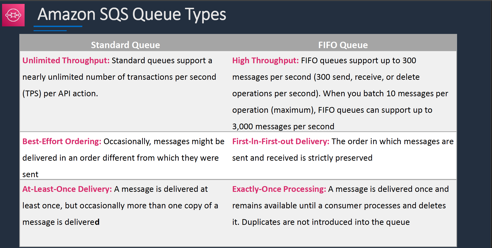
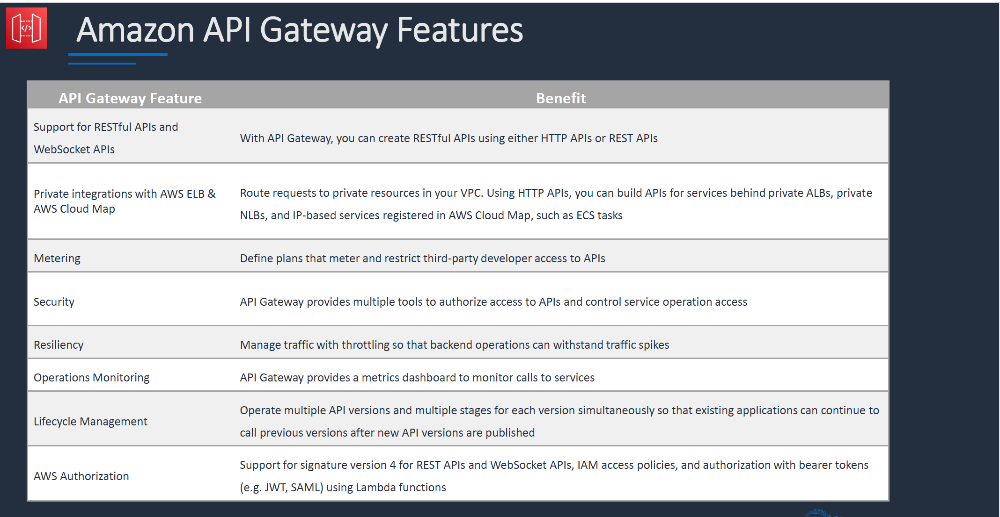
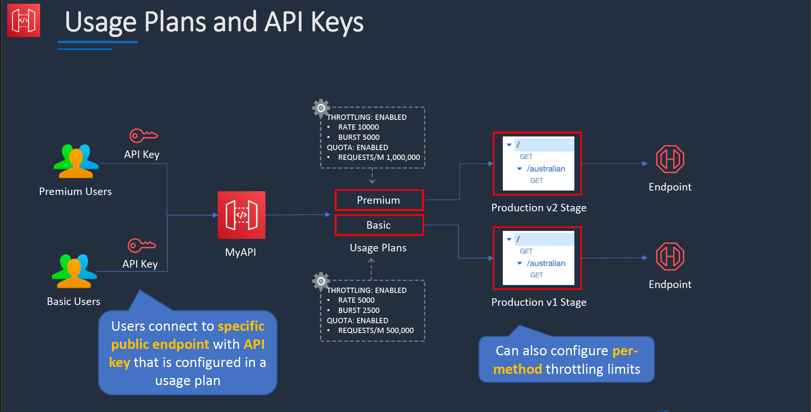
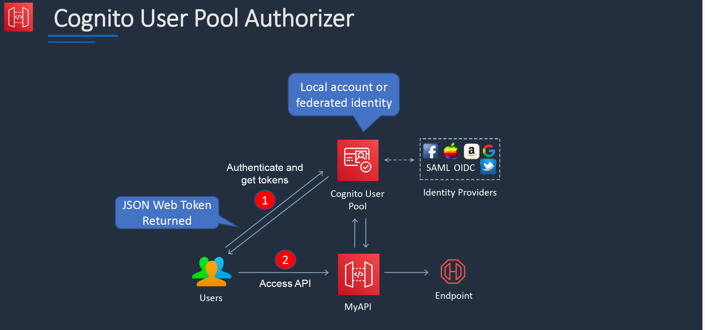

# Section 9: Application Integration and APIs

## Amazon Simple Queue Service (SQS)
__Introduction__  
* Amazon SQS is __pull-based__, not push-based (like SNS)
* Messages are up to `256KB` in size
* Larger messages can be sent using the Amazon SQS Extended Client Library for Java
* Messages can be kept in the queue from _1 minute to 14 days_
* Default retention period is _4 days_
* Amazon SQS guarantees that your messages will be processed at least once

__Amazon SQS Queue Types__

* FIFO queues require the __Message Group ID__ and __Message Deduplication ID__ parameters to be added to messages
* __Message Group ID__ (`MessageGroupId`):
  - The tag that specifies that a message belongs to a specific message group
  - Messages that belong to the same message group are guaranteed to be processed in a FIFO manner
  - Messages with a different Group ID may be received out of order
* __Message Deduplication ID__ (`MessageDeduplicationId`)
  - The token used for deduplication of messages within the deduplication interval
  - The de-duplication interval is _5 minutes_
  - Generated as the `SHA-256` with the message body

__Amazon SQS Dead Letter Queue__  
* Dead-letter queue is a standard or FIFO queue that has been specified as a dead-letter queue
* The main task of a dead-letter queue is handling message failure
* Messages are moved to the dead-letter queue when the `ReceiveCount` for a message exceeds the `maxReceiveCount` for a queue
* Dead-letter queues should not be used with standard queues when your application will keep retrying transmission
* Dead-letter queues will break the order of messages in FIFO queues

__Amazon SQS Delay Queue__  
When to use a delay in queue message:
* Large distributed applications which may need to introduce a delay in processing
* You need to apply a delay to an entire queue of messages
* For example, adding a delay of a few seconds to allow updates to sales or stock control databases before sending a notification to a customer confirming an online transaction

__Amazon SQS Visibility Timeout__  
* The amount of time a message is invisible in the queue after a reader picks it up
* Provided the job is processed before the visibility timeout expires, the message will then be deleted from the queue
* If the job is not processed within the visibility timeout, the message will become visible again and another reader will process it
* This could result in the same message being delivered twice
* Default visibility timeout is _30 seconds_
* Maximum is _12 hours_  

__SQS Long Polling vs Short Polling__  
* SQS __Long polling__ is a way to retrieve messages from SQS queues – waits for messages to arrive
* SQS __Short polling__ returns immediately (even if the message queue is empty)
* SQS Long polling can lower costs
* SQS Long polling can be enabled at the queue level or at the API level using `WaitTimeSeconds`
* SQS Long polling is in effect when the Receive Message Wait Time is a value greater than 0 seconds and up to 20 seconds

### Amazon SQS API
`ChangeMessageVisibility`    
* Changes the visibility timeout of a specified message in a queue to a new value
* Default is 30 seconds; minimum is 0 seconds; maximum is 12 hours

`GetQueueAttributes` and `SetQueueAttributes`  
* Gets/sets attributes for the specified queue
* Lots of possible values and recommend reviewing them in the AWS API reference
* Key attributes for the exam:
  - `DelaySeconds` – Configures a delay queue. 0/s to 900/s (default 0/s)
  - `ReceiveMessageWaitTimeSeconds` – Sets short/long polling. 0/s to 20/s (default 0s)
  - `VisibilityTimeout` - The visibility timeout for the queue. 0/ to 43,200/s (12 hours) (default 30/s)

`ReceiveMessage`  
* Retrieves one or more messages (up to 10), from the specified queue
* Using the `WaitTimeSeconds` parameter enables long-poll support

`SendMessage`  
* DelaySeconds parameter delays a message
* `MessageDeduplicationId` parameter adds a deduplication ID (FIFO only)
* `MessageGroupId` parameter adds a tag for a message group (FIFO only)

__Amazon SQS Extended Client Library__   
* Maximum messages size in SQS is __256 KB__
* You can use Amazon S3 and the __Amazon SQS Extended Client Library for Java__ to manage Amazon SQS messages
* Useful for storing and consuming messages up to __2 GB__ in size
* You can use the Amazon SQS Extended Client Library for Java library to do the following:
  - Specify whether messages are always stored in Amazon S3 or only when the size of a message exceeds 256 KB
  - Send a message that references a single message object stored in an Amazon S3 bucket
  - Get the corresponding message object from an Amazon S3 bucket
  - Delete the corresponding message object from an Amazon S3 bucket

## Amazon SNS
__Introduction__  
* Amazon SNS is a highly available, durable, secure, fully managed pub/sub messaging service
* Amazon SNS provides topics for high-throughput, push-based, many-to-many messaging
* Publisher systems can fan out messages to a large number of subscriber endpoints:
* Endpoints include:
  - Amazon SQS queues
  - AWS Lambda functions
  - HTTP/S webhooks
  - Mobile push
  - SMS
  - Email
* Multiple recipients can be grouped using Topics
* A topic is an “access point” for allowing recipients to dynamically subscribe for identical copies of the same notification
* One topic can support deliveries to multiple endpoint types
* Simple APIs and easy integration with applications
* Flexible message delivery over multiple transport protocols

__Amazon SNS + Amazon SQS Fan-Out__  
* You can subscribe one or more Amazon SQS queues to an Amazon SNS topic
* Amazon SQS manages the subscription and any necessary permissions
* When you publish a message to a topic, Amazon SNS sends the message to every subscribed queue

## AWS Step Functions
__Introduction__  
* AWS Step Functions is used to build distributed applications as a series of steps in a visual workflow.
* You can quickly build and run state machines to execute the steps of your application

__How it works__  
1. Define the steps of your workflow in the __JSON-based Amazon States Language__. The visual console automatically graphs each step in the order of execution
2. Start an execution to visualize and verify the steps of your application are operating as intended. The console highlights the real-time status of each step and provides a detailed history of every execution
3. AWS Step Functions __operates and scales__ the steps of your __application and underlying compute__ for you to help ensure your application executes reliably under increasing demand

## Amazon EventBridge

## Amazon API Gateway
__Amazon API Gateway API Types__
* Amazon API Gateway supports:
* __REST APIs__ - support OIDC and OAuth 2.0 authorization, and come with built-in support for CORS and automatic deployments
* __HTTP APIs__ - designed for low-latency, cost-effective integrations with AWS services, including AWS Lambda, and HTTP endpoints
* __WebSocket APIs__ – deployed as a stateful frontend for an AWS service (such as Lambda or DynamoDB) or for an HTTP endpoint
* REST APIs and HTTP APIs support authorizers for AWS Lambda, IAM, and Amazon Cognito
* WebSocket APIs support IAM authorization and Lambda authorizers

__Amazon API Gateway Deployment Types__  
* Edge-optimized endpoint:
  - Key benefits:
    * Reduced latency for requests from around the world
* Regional endpoint:  
  - Key benefits:
    * Reduced latency for requests that originate in the same region
    * Can also configure your own CDN and protect with WAF
* Private endpoint:
  - Key benefits:
    *  Securely expose your REST APIs only to other services within your VPC or connect via Direct Connect

__Edge-Optimized APIs__  
* An edge-optimized API endpoint is best for geographically distributed clients
* API requests are routed to the nearest CloudFront Point of Presence (POP)
* This is the default endpoint type for API Gateway REST APIs
* Edge-optimized APIs capitalize the names of HTTP headers

__Regional APIs__  
* A regional API endpoint is intended for clients in the same region
* Reduces connection overhead for connections from the same Region
* Any custom domain name that you use is specific to the region where the API is deployed
* If you deploy a regional API in multiple regions, it can have the same custom domain name in all regions

__API Gateway Private REST APIs__  
* Private REST APIs can only be accessed from within a VPC using an interface VPC endpoint

__Amazon API Gateway Features__  

### Methods, Integrations, and Mapping Templates
__Methods and Resources__  
* A __resource__ represents a path in your API
* __Methods__ are created within resources
* A method represents a client-facing interface by which the client calls the API to access back-end resources
* A method is created for a specific HTTP verb, or you can use ANY

__Method Requests / Responses__  
* A Method resource is integrated with an Integration resource
* __Method request:__
  - The public interface of a REST API method in API Gateway that defines the parameters and body that an app developer must send in requests to access the backend through the API
* __Method response:__  
  - The public interface of a REST API that defines the status codes, headers, and body models that an app developer should expect in responses from the API

__Integration Requests / Responses__  
* API methods are integrated with backend endpoints using API integrations
* Backend endpoints are known as “integration endpoints”
* __Integration request:__
  - The internal interface of a WebSocket API route or REST API method in API Gateway
  - Maps the body of a route request or the parameters and body of a method request to the formats required by the backend
* __Integration response:__  
  - The internal interface of a WebSocket API route or REST API method in API Gateway
  - Maps the status codes, headers, and payload that are received from the backend to the response format that is returned to a client app

__Integration Types__  
* You choose an API integration type according to the types of integration endpoint you work with and how you want data to pass to and from the integration endpoint
* For a Lambda function, you can have the __Lambda proxy integration__, or the __Lambda custom integration__
* For an HTTP endpoint, you can have the __HTTP proxy integration__ or the __HTTP custom integration__
* For an AWS service action, you have the AWS integration of the __non-proxy__ type only
* API Gateway also supports the mock integration, where API Gateway serves as an integration endpoint to respond to a method request

__`AWS` Integration Type__   
* This type of integration lets an API expose AWS service actions
* Must configure both the integration request and integration response and set up necessary data mappings from the method request to the integration request, and from the integration response to the method response

__`AWS_PROXY` Integration Type__   
* This integration relies on direct interactions between the client and the integrated Lambda function
* With this type of integration, also known as the _Lambda proxy integration_, __you do not set the integration request or the integration response__
* API Gateway passes the incoming request from the client as the input to the backend Lambda function
* The integrated Lambda function takes the input of this format and parses the input from all available sources, including request headers, URL path variables, query string parameters, and applicable body
* The function returns the result following this output format

__`HTTP` Integration Type__  
* This type of integration lets an API expose HTTP endpoints in the backend
* With the HTTP integration, also known as the _HTTP custom integration_, you must configure both the integration request and integration response
* You must set up necessary data mappings from the method request to the integration request, and from the integration response to the method response

__`MOCK` Integration Type__  
* This type of integration lets API Gateway return a response without sending the request further to the backend
* Used to test the integration set up without incurring charges for using the backend and to enable collaborative development of an API
* A team can isolate their development effort by setting up simulations of API components owned by other teams by using the MOCK integrations

__Mapping Templates__  
* An API's method request can take a payload in a different format from the corresponding integration request payload, as required in the backend
* Similarly, the backend may return an integration response payload different from the method response payload, as expected by the frontend
* API Gateway lets you use __mapping templates__ to map the payload from a method request to the corresponding integration request and from an integration response to the corresponding method response
* A mapping template is a script expressed in _Velocity Template Language (VTL)_ and applied to the payload using _JSONPath expressions_

### API Gateway Stages and Deployments
__API Gateway Stages and Deployments__
* Deployments are a snapshot of the APIs resources and methods
* Deployments must be created and associated with a stage for anyone to access the API
* A stage is a logical reference to a lifecycle state of your REST or WebSocket API (e.g. ‘dev’, ‘prod’, ‘beta’, ‘v2’)
* API stages are identified by API ID and stage name
* Stage variables are like environment variables for API Gateway
* Stage variables can be used in:
  - Lambda function ARN
  - HTTP endpoint
  - Parameter mapping templates

__Use cases for stage variables__
* Configure HTTP endpoints your stages talk to (dev, test, prod etc.)
* Pass configuration parameters to AWS Lambda through mapping templates
* Stage variables are passed to the _“context”_ object in Lambda
* Stage variables are used with Lambda aliases
* You can create a stage variable to indicate the corresponding Lambda alias
* You can create _canary deployments_ for any stage and choose the % of traffic the canary channel receives

__Swagger and Open API 3__  
* You can import existing Swagger / Open API 3.0 definitions (written in YAML or JSON) to API Gateway
* This is a common way of defining REST APIs using API definition as code
* Can also export current APIs as Swagger / Open API 3.0 definition
* Uses the API Gateway Import API feature to import an API from an external definition
* You specify the options using a mode query parameter in the request URL

### API Gateway Caching and Throttling
__API Gateway - Caching__
* You can add caching to API calls by provisioning an Amazon API Gateway
cache and specifying its size in gigabytes
* Caching allows you to cache the endpoint's response
* Caching can reduce number of calls to the backend and improve latency of
requests to the API

__API Gateway Caching__
* API Gateway caches responses for a specific amount of time (time to live or TTL)
* The default TTL is 300 seconds (min 0, max 3600)
* Caches are defined per stage
* You can encrypt caches
* The cache capacity is between __0.5GB to 237GB__
* It is possible to override cache settings for specific methods
* You can flush the entire cache (invalidate it) immediately if required
* Clients can invalidate the cache with the header: `Cache-Control: max-age=0`

__API Gateway - Throttling__  
* API Gateway sets a limit on a steady-state rate and a burst of request submissions against all APIs in your account
* Limits:
  - By default, API Gateway limits the steady-state request rate to __10,000 requests per second__
  - The maximum concurrent requests is __5,000 requests across all APIs__ within an AWS account
  - If you go over 10,000 requests per second or 5,000 concurrent requests, you will receive a `429 Too Many Requests` error response
* Upon catching such exceptions, the client can resubmit the failed requests in a way that is rate limiting, while complying with the API Gateway throttling limits

__API Gateway Throttling__  
* Amazon API Gateway provides two basic types of throttling-related settings:
* __Server-side__ throttling limits are applied across all clients. These limit settings exist to prevent your API—and your account—from being overwhelmed by too many requests
* __Per-client__ throttling limits are applied to clients that use API keys associated with your usage policy as client identifier
* API Gateway throttling-related settings are applied in the following order:
  - Per-client per-method limits that you set for an API stage in a usage plan
  - Per-client limits that you set in a usage plan
  - Default per-method limits and individual per-method limits that you set in API stage settings
  - Account-level throttling

### API Gateway Usage Plans and API Keys

__Usage Plans and API Keys__  
* A usage plan specifies who can access one or more deployed API stages and methods — and how much and how fast they can access them
* You can use a usage plan to configure throttling and quota limits, which are enforced on individual client API keys
* The plan uses API keys to identify API clients and meters access to the associated API stages for each key
* It also lets you configure throttling limits and quota limits that are enforced on individual client API keys
* You can use API keys together with usage plans or Lambda authorizers to control access to your APIs

### API Gateway Access Control
__API Gateway Access Control__  
There are several mechanisms for controlling and managing access to an API:
* Resource-based policies
* Identity-based policies
* IAM Tags
* Endpoint policies for interface VPC endpoints
* Lambda Authorizers
* Amazon Cognito user pools

__Resource Based Policies__  
* Amazon API Gateway resource policies are JSON policy documents that
you attach to an API
* Control whether a specified principal can invoke the API
* Policy can grant/deny access based on: AWS account, VPC or VPC endpoint, or CIDR block / IP range

__Lambda Authorizer__   
* A Lambda authorizer is an API Gateway feature that uses a Lambda function to control access to your API
* API Gateway calls the Lambda authorizer, which takes the caller's identity as input and returns an IAM policy as output
* There are two types of Lambda authorizers:
  - A __token-based__ Lambda authorizer receives the caller's identity in a bearer token, such as a JSON Web Token (JWT) or an OAuth token.
  - A __request parameter-based__ Lambda authorizer receives the caller's identity in a combination of headers, query string parameters, stageVariables, and $context variables
* For WebSocket APIs, only request parameter-based authorizers are supported

__How Lambda Authorizer Works__  
1. Client calls API method, passing bearer token or request parameters
2. API Gateway calls the Lambda authorizer
3. Lambda function authenticates the user:
  * Call OAuth provider to get token
  * Call SAML provider to get assertion
  * Generate IAM Policy based on request parameters
4. If successful, Lambda grants access and returns IAM policy and a principal identifier
5. API Gateway evaluates the policy:
  * If access is allowed, execute the method
  * If access is denied, return status code (e.g. 403)

__Cognito User Pool Authorizer__  
* A user pool is a user directory in Amazon Cognito
* With a user pool, users can sign into a web or mobile app through Amazon Cognito
* Users can also sign in through social identity providers like Google, Facebook, Amazon, or Apple, and through SAML identity providers
* You can use an Amazon Cognito user pool to control who can access your API in Amazon API Gateway
* You create an authorizer of the `COGNITO_USER_POOLS` type and then configure an API method to use that authorizer  

