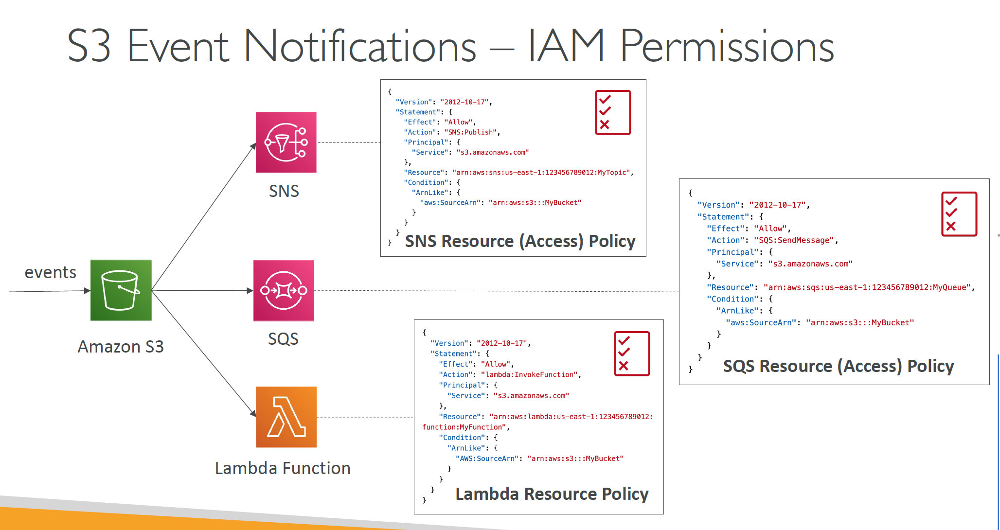

# Section 13: Amazon S3 – Advanced

__S3 Event Notifications__  
* `S3:ObjectCreated`, `S3:ObjectRemoved`, `S3:ObjectRestore`, `S3:Replication`…
* Object name filtering possible (*.jpg)
* Use case: generate thumbnails of images
uploaded to S3
* _Can create as many “S3 events” as desired_
* S3 event notifications typically deliver events in seconds but can sometimes take a minute or longer

__S3 Event Notifications – IAM Permissions__
  

__S3 Event Notifications with Amazon EventBridge__  
* __Advanced filtering__ options with JSON rules (metadata, object size, name...)
* __Multiple Destinations__ – ex Step Functions, Kinesis Streams / Firehose…
* __EventBridge Capabilities__ – Archive, Replay Events, Reliable delivery

__S3 – Baseline Performance__  
* Amazon S3 automatically scales to high request rates, _latency 100-200 ms_
* Your application can achieve at least _3,500 PUT/COPY/POST/DELETE_ or _5,500 GET/HEAD requests per second per prefix_ in a bucket.
* There are no limits to the number of prefixes in a bucket.
* If you spread reads across all four prefixes evenly, you can achieve 22,000 requests per second for GET and HEAD

__S3 Performance__  
* __Multi-Part upload:__
  - recommended for files > 100MB, must use for files > 5GB
  - Can help parallelize uploads (speed up transfers)
* __S3 Transfer Acceleration__
  - Increase transfer speed by transferring file to an AWS edge location which will forward the data to the S3 bucket in the target region
  - Compatible with multi-part upload

__S3 Performance – S3 Byte-Range Fetches__  
* Parallelize GETs by requesting specific
byte ranges
* Better resilience in case of failures
* Can be used to speed up downloads
* Can be used to retrieve only partial data (for example the head of a file)

__S3 User-Defined Object Metadata & S3 Object Tags__   
* __S3 User-Defined Object Metadata__
  - When uploading an object, you can also assign metadata
  - Name-value (key-value) pairs
  - User-defined metadata names must begin with `x-amz-meta-`
  - Amazon S3 stores user-defined metadata keys in lowercase
  - Metadata can be retrieved while retrieving the object
* __S3 Object Tags__
  - Key-value pairs for objects in Amazon S3
  - Useful for fine-grained permissions (only access specific objects with specific tags)
  - Useful for analytics purposes (using S3 Analytics to group by tags)
* You cannot search the object metadata or object tags
* Instead, you must use an external DB as a search index such as DynamoDB

__Meta Data__   

Key               | Value
------------------|-----
Content-Length    | 7.5 KB
Content-Type      | html
x-amz-meta-origin | paris
