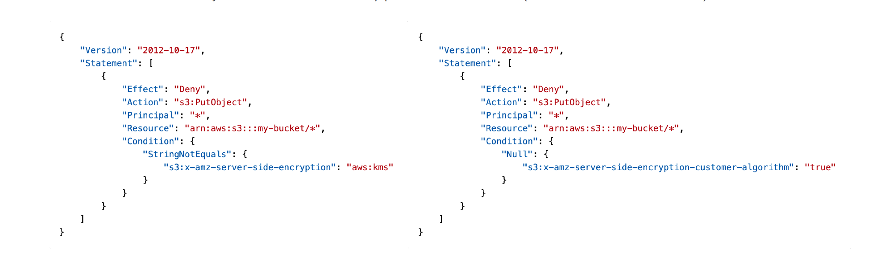

# Section 14: Amazon S3 – Security

__Amazon S3 Encryption – SSE-S3__  
* Encryption using keys handled, managed, and owned by AWS
* Object is encrypted server-side
* Encryption type is AES-256
* Must set header `"x-amz-server-side-encryption": "AES256"`
* _Enabled by default for new buckets & new objects_

__Amazon S3 Encryption – SSE-KMS__  
* Encryption using keys handled and managed by AWS KMS (Key Management Service)
* KMS advantages: user control + audit key usage using CloudTrail
* Object is encrypted server side
* Must set header `"x-amz-server-side-encryption": "aws:kms"`

__SSE-KMS Limitation__   
* If you use SSE-KMS, you may be impacted
by the KMS limits
* When you upload, it calls the `GenerateDataKey` KMS API
* When you download, it calls the `Decrypt` KMS API
* Count towards the KMS quota per second
(5,500, 10,000, 30,000 req/s based on region)
* You can request a quota increase using the Service Quotas Console

__Amazon S3 Encryption – SSE-C__  
* Server-Side Encryption using keys fully managed by the customer outside of AWS
* Amazon S3 does _NOT_ store the encryption key you provide
* HTTPS must be used
* Encryption key must be provided in HTTP headers, for every HTTP request made

__Amazon S3 Encryption – Client-Side Encryption__
* Use client libraries such as Amazon S3 Client-Side Encryption Library
* Clients must encrypt data themselves before sending to Amazon S3
* Clients must decrypt data themselves when retrieving from Amazon S3
* Customer fully manages the keys and encryption cycle

__Amazon S3 – Encryption in transit (SSL/TLS)__  
* Encryption in flight is also called _SSL/TLS_
* Amazon S3 exposes two endpoints:
  - HTTP Endpoint – non encrypted
  - HTTPS Endpoint – encryption in flight
* _HTTPS is recommended_
* _HTTPS is mandatory for SSE-C_
* Most clients would use the HTTPS endpoint by default

__Amazon S3 – Force Encryption in Transit using Bucket Policy__  
```json
{
  "version": "2012-10-17",
  "Statement": [
    {
      "Effect": "Deny",
      "Principal": "*",
      "Action": "s3:GetObject",
      "Resource": "arn:aws:s3:::my-bucket/*",
      "Condition": {
        "Bool": {
          "aws:SecureTransport": "false"
        }
      }
    }
  ]
}
```


__Amazon S3 – Default Encryption vs. Bucket Policies__  
* SSE-S3 encryption is automatically applied to new objects stored in S3 bucket
* Optionally, you can “force encryption” using a bucket policy and refuse any API call to PUT an S3 object without encryption headers (SSE-KMS or SSE-C)

* _Note: Bucket Policies are evaluated before “Default Encryption”_
