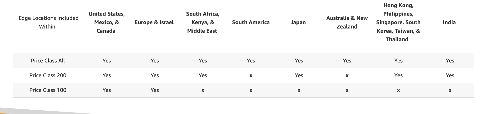
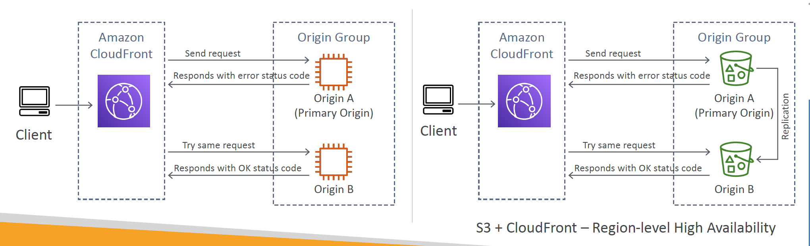

# Section 15: CloudFront
__CloudFront – Origins__  
* __S3 bucket__
  - For distributing files and caching them at the edge
  - For uploading files to S3 through CloudFront (This may not be correct - Chucks)
  - Secured using Origin Access Control (OAC)
* __VPC Origin__
  - For applications hosted in VPC private subnets
  - Application Load Balancer / Network Load Balancer / EC2 Instances
* __Custom Origin (HTTP)__
  - S3 website (must first enable the bucket as a static S3 website)
  - Any public HTTP backend you want

__CloudFront vs S3 Cross Region Replication__  
* CloudFront:
  - Global Edge network
  - Files are cached for a TTL (maybe a day)
  - Great for static content that must be available everywhere
* S3 Cross Region Replication:
  - Must be setup for each region you want replication to happen
  - Files are updated in near real-time
  - Read only
  - Great for dynamic content that needs to be available at low-latency in few regions

__CloudFront Caching__  
* The cache lives at each CloudFront __Edge Location__
* CloudFront identifies each object in the cache using the __Cache Key__
* You want to maximize the Cache Hit ratio to minimize requests to the origin
* You can invalidate part of the cache using the `CreateInvalidation` API

__What is CloudFront Cache Key?__  
* A unique identifier for every object in the cache
* By default, consists of _hostname + resource portion of the URL_
* If you have an application that serves up content that varies based on user, device, language, location…
* You can add other elements (HTTP headers, cookies, query strings) to the Cache Key using _CloudFront Cache Policies_  

__CloudFront Policies – Cache Policy__  
* Cache based on:
  - __HTTP Headers:__ None | Whitelist
  - __Cookies:__ None | Whitelist | Include All-Except | All
  - __Query Strings:__ None | Whitelist | Include All-Except | All
* Control the TTL (0 seconds to 1 year), can be set by the origin using the _Cache-Control_ header, _Expires_ header…
* Create your own policy or use Predefined Managed Policies
* _All HTTP headers, cookies, and query strings that you include in the Cache Key are automatically included in origin requests_

__Cache Policy: HTTP Headers__  
* __None:__
  - Don’t include any headers in the Cache Key (except default)
  - Headers are not forwarded (except default)
  - Best caching performance
* __Whitelist:__
  - only specified headers included in the Cache Key
  - Specified headers are also forwarded to Origin

__Cache Policy: Query Strings__  
* __None:__
  - Don’t include any query strings in the Cache Key
  - Query strings are not forwarded
* __Whitelist:__
  - Only specified query strings included in the Cache Key
  - Only specified query strings are forwarded
* __Include All-Except:__  
  - Include all query strings in the Cache Key except the specified list
  - All query strings are forwarded except the specified list
* __All:__  
  - Include all query strings in the Cache Key
  - All query strings are forwarded
  - Worst caching performance

__CloudFront Policies – Origin Request Policy__  
* Specify values that you want to include in origin requests _without including them in the Cache Key_ (no duplicated cached content)
* You can include:
  - __HTTP headers:__ None | Whitelist | All viewer headers options
  - __Cookies:__ None | Whitelist | All
  - __Query Strings:__ None | Whitelist | All
* Ability to add CloudFront HTTP headers and Custom Headers to an origin request that were not included in the viewer request
* Create your own policy or use Predefined Managed Policies

__CloudFront – Cache Invalidations__  
* In case you update the back-end origin, CloudFront doesn’t know about it and will only get the refreshed content after the TTL has expired
* However, you can force an entire or partial cache refresh (thus bypassing the TTL) by performing a _CloudFront Invalidation_
* You can invalidate all files (`/*`) or a special path (`/images/*`)

__CloudFront – Cache Behaviors__   
* Configure different settings for a given URL path pattern
* Example: one specific cache behavior to `images/*.jpg` files on your origin web server
* Route to different kind of origins/origin groups based on the content type or path pattern
  - `/images/*`
  - `/api/*`
  - `/*` (default cache behavior)
* When adding additional Cache Behaviors, the Default Cache Behavior is always the last to be processed and is always `/*`

__CloudFront – ALB or EC2 as an origin Using VPC Origins__  
* Allows you to deliver content from your applications hosted in your VPC private subnets (no need to expose them on the Internet)
* Deliver traffic to _private_:
  - Application Load Balancer
  - Network Load Balancer
  - EC2 Instances

__CloudFront Signed URL / Signed Cookies__   
* You want to distribute paid shared content to premium users over the world
* We can use CloudFront Signed URL / Cookie. We attach a policy with:
  - Includes URL expiration
  - Includes IP ranges to access the data from
  - Trusted signers (which AWS accounts can create signed URLs)
* How long should the URL be valid for?
  - Shared content (movie, music): make it short (a few minutes)
  - Private content (private to the user): you can make it last for years
* Signed URL = access to individual files (one signed URL per file)
* Signed Cookies = access to multiple files (one signed cookie for many files)

__CloudFront Signed URL vs S3 Pre-Signed URL__  
* __CloudFront Signed URL:__
  - Allow access to a path, no matter the origin
  - Account wide key-pair, only the root can manage it
  - Can filter by IP, path, date, expiration
  - Can leverage caching features
* __S3 Pre-Signed URL:__
  - Issue a request as the person who pre-signed the URL
  - Uses the IAM key of the signing IAM principal
  - Limited lifetime

__CloudFront Signed URL Process__  
* There are two types of signers:
  1. Either a _Trusted Key Group_ (recommended)
    * Can leverage CloudFront APIs to create and rotate keys (and IAM for API security). Can be automated
    * By default you can associate up to _four key groups with a single distribution_
    * You can have up to _five public keys in a key group_
  2. An AWS Account that contains a _CloudFront Key Pair_
    * Need to manage keys using the root account and the AWS console. Cannot be automated
    * Not recommended because you shouldn’t use the root account for this
    * You can only have up to _two active CloudFront key pairs_ per AWS account.
* In your CloudFront distribution, create one or more trusted key groups
* You generate your own public / private key
* The private key is used by your applications (e.g. EC2) to sign URLs
* The public key (uploaded) is used by CloudFront to verify URLs

__CloudFront – Price Classes__   
* You can reduce the number of edge locations for cost reduction
* Three price classes:
  1. Price Class All: all regions – best performance
  2. Price Class 200: most regions, but excludes the most expensive regions
  3. Price Class 100: only the least expensive regions

__CloudFront – Origin Groups__   
* To increase high-availability and do failover
* Origin Group: one primary and one secondary origin
* If the primary origin fails, the second one is used

__CloudFront – Field Level Encryption__  
* Protect user sensitive information through application stack
* Adds an additional layer of security along with HTTPS
* Sensitive information encrypted at the edge close to user
* Uses asymmetric encryption
* Usage:
  - Specify set of fields in POST requests that you want to be encrypted (up to 10 fields)
  - Specify the public key to encrypt them

__CloudFront – Real Time Logs__    
* Get real-time requests received by CloudFront sent to Kinesis Data Streams
* Monitor, analyze, and take actions based on content delivery performance
* Allows you to choose:
  - _Sampling Rate_ – percentage of requests for which you want to receive
  - Specific fields and specific Cache Behaviors (path patterns)
