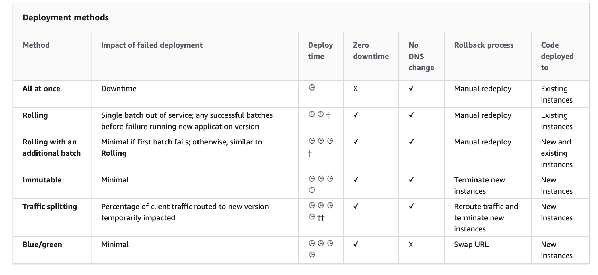

# Section 17 AWS Elastic Beanstalk

__Elastic Beanstalk – Components__  
* __Application:__ collection of Elastic Beanstalk components (environments, versions, configurations, …)
* __Application Version:__ an iteration of your application code
* __Environment__
  - Collection of AWS resources running an application version (only one application
version at a time)
  - __Tiers:__ Web Server Environment Tier & Worker Environment Tier
  - You can create multiple environments (dev, test, prod, …)

__Elastic Beanstalk Deployment Modes__  
* Single Instance (Great for dev)
* High Availability with Load Balancer (Great for prod)

### Elastic Beanstalk Deployments Policies
__Beanstalk Deployment Options for Updates__   
1. __All at once (deploy all in one go):__ fastest, but instances aren’t available to serve traffic for a bit (downtime)
2. __Rolling:__ update a few instances at a time (bucket), and then move onto the next bucket once the first bucket or batch is healthy
3. __Rolling with additional batches:__ like rolling, but spins up new instances to move the batch (so that the old application is still available)
4. __Immutable:__ spins up new instances in a new ASG, deploys version to these instances, and then swaps all the instances when everything is healthy
5. __Blue Green:__ create a new environment and switch over when ready
6. __Traffic Splitting:__ canary testing – send a small % of traffic to new deployment

__Deployment policy: All at once__  
* Fastest deployment
* Application has downtime
* Great for quick iterations in development environment
* No additional cost

__Deployment policy: Rolling__  
* Application will run below capacity during the update
* Can set the bucket or batch size
* Application will be running both versions simultaneously at some points during the deployment
* No additional cost is incured
* Longer deployment time

__Deployment policy: Rolling with additional batches__  
* Application will always be running at capacity
* Can set the bucket or batch size
* Application will be running both versions simultaneously at some point in the update process
* Will incure small additional cost
* Additional batch is removed at the end of the deployment
* Longer deployment time
* Good for production workload

__Deployment policy: Immutable__  
* Zero downtime
* New Code is deployed to new instances on a _temporary ASG_
* High cost, double capacity
* Longest deployment time
* _Quick rollback_ in case of failures (just terminate new ASG)
* Great for production workload

__Deployment policy: Traffic Splitting__  
* Canary Testing
* New application version is deployed to a _temporary ASG_ with the same capacity
* A small % of traffic is sent to the temporary ASG for a configurable amount of time
* Deployment health is monitored
* If there’s a deployment failure, this triggers an _automated rollback_ (very quick)
* No application downtime
* New instances are migrated from the temporary to the original ASG
* Old application version is then terminated

__Blue / Green (Not a deployment policy)__  
* Not a “direct feature” of Elastic Beanstalk
* Zero downtime and release facility
* Create a _new “stage” environment_ and deploy v2 there
* The new environment (green) can be validated independently and roll back if issues
* Route 53 can be setup using weighted policies to redirect a little bit of traffic to the stage environment
* Using Beanstalk, “swap URLs” when done with the environment test

__Elastic Beanstalk Deployment Summary__  

__Elastic Beanstalk CLI__  
* We can install an additional CLI called the _EB CLI_ which makes working with Beanstalk from the CLI easier
* Basic commands are:
  - `eb create`
  - `eb status`
  - `eb health`
  - `eb events`
  - `eb logs`
  - `eb open`
  - `eb deploy`
  - `eb config`
  - `eb terminate`
* It’s helpful for your automated deployment pipelines!

__Elatic Beanstalk Deployment Process__  
* Describe dependencies (requirements.txt for Python, package.json for Node.js)
* Package code as zip, and describe dependencies
  - Python: requirements.txt
  - Node.js: package.json
* __Console:__ upload zip file (creates new app version), and then deploy
* __CLI:_ create new app version using CLI (uploads zip), and then deploy
* Elastic Beanstalk will deploy the zip on each EC2 instance, resolve dependencies and start the application

__Beanstalk Lifecycle Policy__  
* Elastic Beanstalk can store at most 1000 application versions
* If you don’t remove old versions, you won’t be able to deploy anymore
* To phase out old application versions, use a __lifecycle policy__
  - Based on time (old versions are removed)
  - Based on space (when you have too many versions)
* Versions that are currently used won’t be deleted
* Option not to delete the source bundle in S3 to prevent data loss

__Elastic Beanstalk Extensions__  
* A zip file containing our code must be deployed to Elastic Beanstalk
* All the parameters set in the UI can be configured with code using files
* Requirements:
  - in the `.ebextensions/` directory in the root of source code
  - YAML / JSON format
  - Must have `.config` extensions (example: logging.config)
  - Able to modify some default settings using: `option_settings`
* Ability to add resources such as RDS, ElastiCache, DynamoDB, etc…

__Elastic Beanstalk Under the Hood__  
* Under the hood, Elastic Beanstalk relies on CloudFormation
* CloudFormation is used to provision other AWS services (we’ll see later)
* __Use case:__ you can define CloudFormation resources in your
`.ebextensions` to provision ElastiCache, an S3 bucket, anything you want!

__Elastic Beanstalk Cloning__  
* Clone an environment with the exact same configuration
* Useful for deploying a “test” version of your application
* All resources and configuration are preserved:
  - Load Balancer type and configuration
  - RDS database type (but the data is not preserved)
  - Environment variables
* After cloning an environment, you can change settings cloning

__Elastic Beanstalk Migration: Load Balancer__  
* After creating an Elastic Beanstalk environment, you cannot change the Elastic Load Balancer type (only the configuration)
* To migrate:
  1. create a new environment with the same configuration except LB (can’t clone)
  2. deploy your application onto the new environment
  3. perform a CNAME swap or Route 53 update

__RDS with Elastic Beanstalk__  
* RDS can be provisioned with Beanstalk, which is great for dev / test
* This is not great for prod as the database lifecycle is tied to the Beanstalk environment lifecycle
* The best for prod is to separately create an RDS database and provide our EB application with the connection string

__Elastic Beanstalk Migration: Decouple RDS__  
1. Create a snapshot of RDS DB (as a safeguard)
2. Go to the RDS console and protect the RDS database from deletion
3. Create a new Elastic Beanstalk environment, without RDS, point your application to existing RDS
4. Perform a CNAME swap (blue/green) or Route 53 update, confirm working
5. Terminate the old environment (RDS won’t be deleted)
6. Delete CloudFormation stack (in DELETE_FAILED state)
