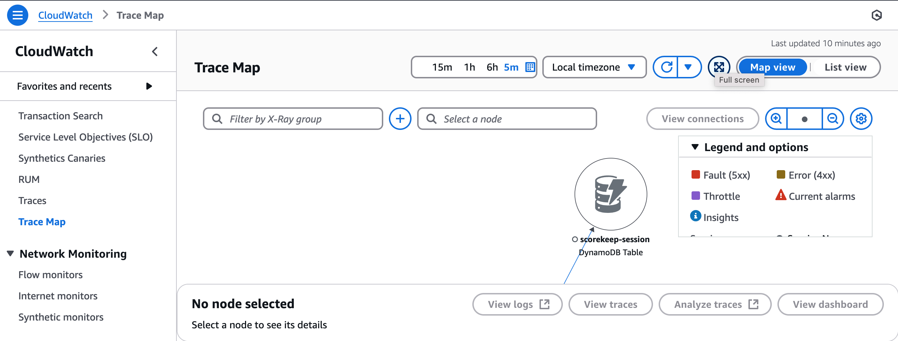
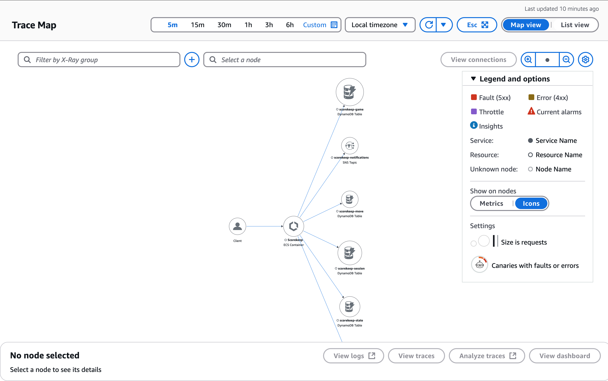
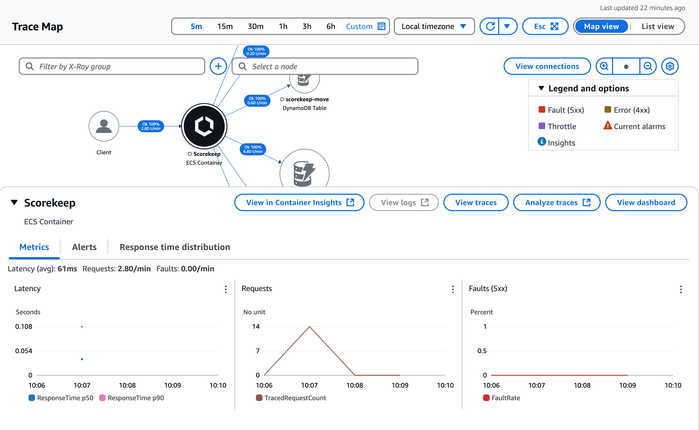

# Lesson 253: X-Ray - Hands On

### Description

This  configuration is used to demonstrate the features that X-Ray provides.  
Here we deploy an Game application to an ECS container.  
The Game application sends request to DynamoDB to store game score in DynamoDB tables and SNS topic for notification.  
The X-Ray traces can then be viewed in the CloudWatch console after a game interaction.  

### Operation

**Before Deployment**

**Deployment**  
Lint the templates

```bash
$ cfn-lint EbJavaScorekeepXraySimplified.yaml
```

Deploy the stack

```bash
$ aws cloudformation deploy --template-file EbJavaScorekeepXraySimplified.yaml  --stack-name ScorekeepXray --parameter-overrides file://private-parameters.json --capabilities CAPABILITY_NAMED_IAM --disable-rollback
```

**After Deployment**  
1. Go to the inbox of the email you provided for the `Email` parameter and confirm the SNS subscription.  
2. Get the `LoadBalancerUrl` from the stack outputs
```bash
$ aws cloudformation describe-stacks --stack-name ScorekeepXray --query "Stacks[0].Outputs" --no-cli-pager
```

**Testing**

1. Use the `LoadBalancerUrl` to access the application in a browser
2. Leave the default input in the text boxes, click the _Create_ button under _Session_.
3. Enter a name for your game, select the aavailable rule, and click create.
4. Open the _"view traces for this session"_ link on another tab to see the traces in the CloudWatch Console > Application Signal > Traces.
5. Back to the application, click the _Play_ button to play a game.
6. Play the Game for a short time.
7. Playing the Game sends traces to X-ray
8. Go to CloudWatch Console > Application Signal > Trace Maps
9. Click the full screen button to see the Trace Map on a full screen
10. Take note that the traces will go away after a short time and you will then need to interact with the Game all over gain to generate new traces.  

### Screenshots of CloudWatch Console

__X-Ray Trace Map__  
  

__X-Ray Trace Map (Fullscreen)__  


__X-Ray Segment Node__  


**Debug Errors**

**Cleanup**  
To delete the stacks

```bash
$ aws cloudformation delete-stack --stack-name ScorekeepXray
```
