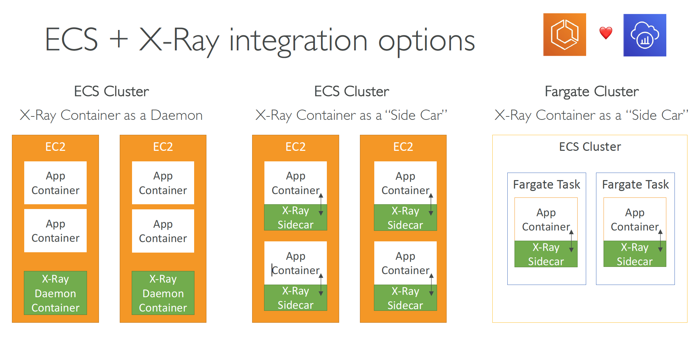

# Lesson 258: X-Ray and ECS

### Description

You can find an example of X-Ray integration with ECS in `hands-on-253-xray-tracing`.  
Also take a look at the sample `task-defintion.json` that shows how X-Ray can be integrated with ECS tasks using the _SideCar_ approach which was also used in `hands-on-253-xray-tracing`.  
With the SideCar approach you run the X-Ray daemon as a separate container within the same task definition as your application container. This allows your application to send trace data to the X-Ray daemon, which then forwards it to the X-Ray service for analysis and visualization.

**ECS X-Ray Integration Options**  

