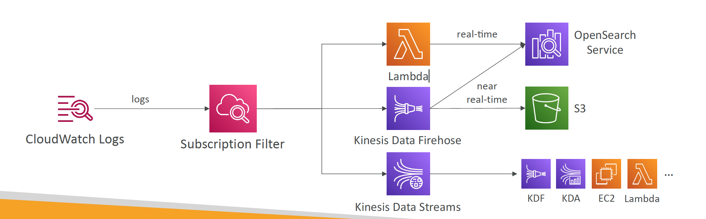
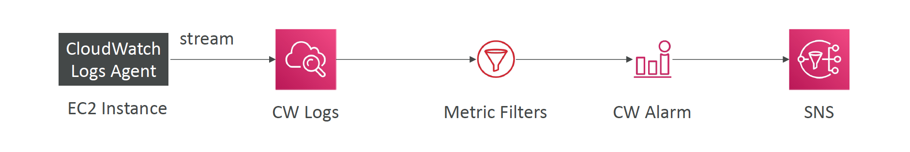
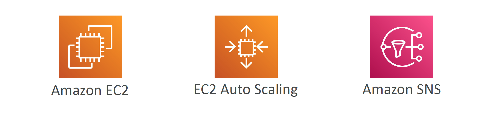
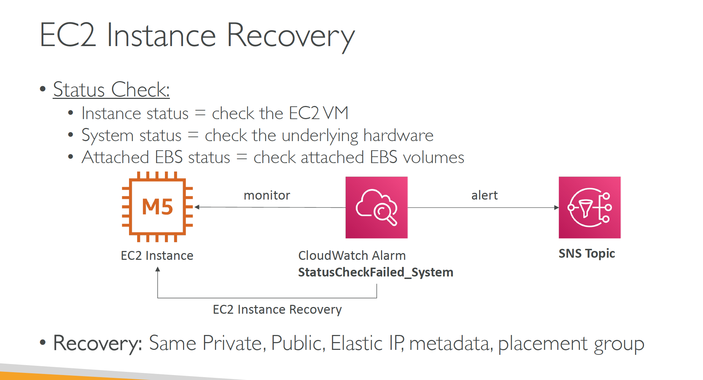
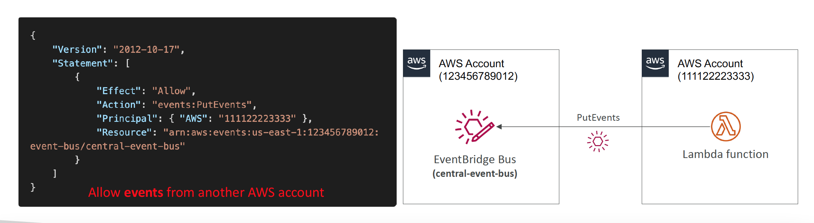
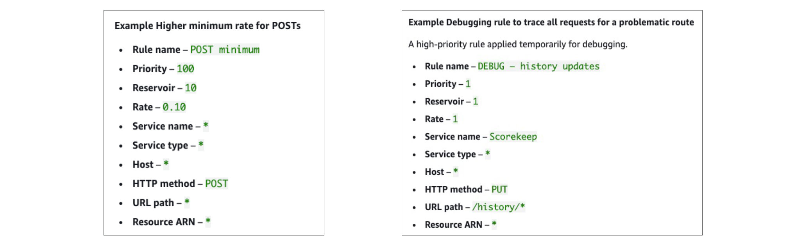
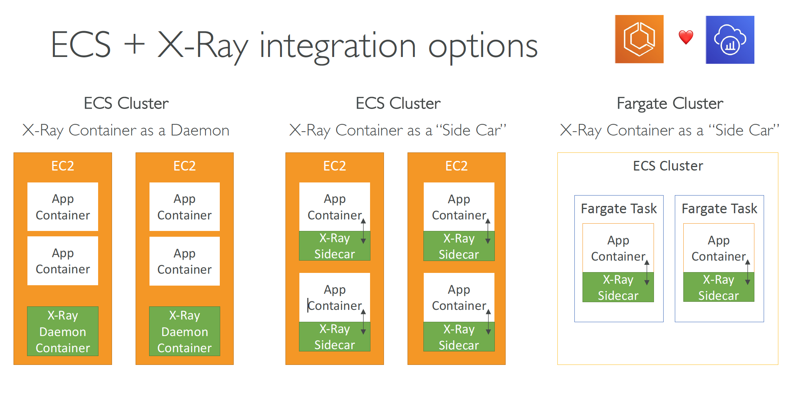
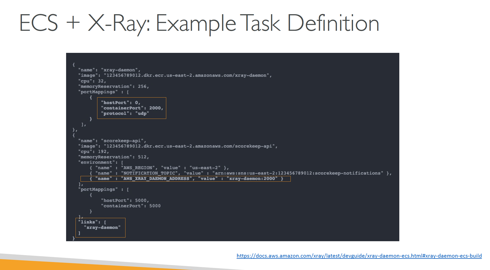

# Section 20: AWS Monitoring, Troubleshooting & Audit
## Monitoring in AWS
* AWS CloudWatch:
  - Metrics: Collect and track key metrics
  - Logs: Collect, monitor, analyze and store log files
  - Events: Send notifications when certain events happen in your AWS
  - Alarms: React in real-time to metrics / events
* AWS X-Ray:
  - Troubleshooting application performance and errors
  - Distributed tracing of microservices
* AWS CloudTrail:
  - Internal monitoring of API calls being made
  - Audit changes to AWS Resources by your users

## CloudWatch
#### CloudWatch Metrics
* CloudWatch provides metrics for every services in AWS
* _Metric_ is a variable to monitor (CPUUtilization, NetworkIn…)
* Metrics belong in namespaces
* _Dimension_ is an attribute of a metric (instance id, environment, etc…).
* Up to 30 dimensions per metric
* Metrics have timestamps
* Can create CloudWatch dashboards of metrics

__EC2 Detailed monitoring__  
* EC2 instance metrics have metrics “every 5 minutes”
* With detailed monitoring (for a cost), you get data “every 1 minute”
* Use detailed monitoring if you want to scale faster for your ASG!
* The AWS Free Tier allows us to have 10 detailed monitoring metrics
* __Note:__ EC2 Memory usage is by default not pushed (must be pushed from inside the instance as a custom metric)

__CloudWatch Custom Metric__   
* Possibility to define and send your own custom metrics to CloudWatch
* Example: memory (RAM) usage, disk space, number of logged in users …
* Use API call `PutMetricData`
* Ability to use dimensions (attributes) to segment metrics
  - Instance.id
  - Environment.name
* Metric resolution (_StorageResolution_ API parameter – two possible value):
  - Standard: 1 minute (60 seconds)
  - High Resolution: 1/5/10/30 second(s) – Higher cost
* __Important:__ Accepts metric data points two weeks in the past and two hours in the future (make sure to configure your EC2 instance time correctly)

#### CloudWatch Logs
__Introduction__  
* __Log groups:__ arbitrary name, usually representing an application
* __Log stream:__ instances within application / log files / containers
* Can define log expiration policies (never expire, 1 day to 10 years…)
  - CloudWatch Logs can send logs to:
  - Amazon S3 (exports)
  - Kinesis Data Streams
  - Kinesis Data Firehose
  - AWS Lambda
  - OpenSearch
* Logs are encrypted by default
* Can setup KMS-based encryption with your own keys

__CloudWatch Logs - Sources__  
* SDK, CloudWatch Logs Agent, CloudWatch Unified Agent
* Elastic Beanstalk: collection of logs from application
* ECS: collection from containers
* AWS Lambda: collection from function logs
* VPC Flow Logs: VPC specific logs
* API Gateway
* CloudTrail based on filter
* Route53: Log DNS queries

__CloudWatch Logs Insights__  
* Search and analyze log data stored in CloudWatch Logs
* Example: find a specific IP inside a log, count occurrences of
“ERROR” in your logs…
* Provides a purpose-built query language
  - Automatically discovers fields from AWS services and JSON log events
  - Fetch desired event fields, filter based on conditions, calculate aggregate statistics, sort events, limit number of events…
  - Can save queries and add them to CloudWatch Dashboards
* Can query multiple Log Groups in different AWS accounts
* It’s a query engine, not a real-time engine

__CloudWatch Logs – S3 Export__  
* Log data can take up to 12 hours to become available for export
* The API call is `CreateExportTask`
* Not near-real time or real-time… use _Logs Subscriptions_ instead

__CloudWatch Logs Subscriptions__  
* Get a real-time log events from CloudWatch Logs for processing and analysis
* Send to Kinesis Data Streams, Kinesis Data Firehose, or Lambda
* __Subscription Filter__ – filter which logs  events are delivered to your destination

  

__CloudWatch Logs for EC2__  
* By default, no logs from your EC2 machine will go to CloudWatch
* You need to run a CloudWatch agent on EC2 to push the log files you want
* Make sure IAM permissions are correct
* The CloudWatch log agent can be setup on-premises too

__CloudWatch Logs Agent & Unified Agent__  
* For virtual servers (EC2 instances, on-premise servers…)
* __CloudWatch Logs Agent__
  - Old version of the agent
  - Can only send to CloudWatch Logs
* __CloudWatch Unified Agent__
  - Collect additional system-level metrics such as RAM, processes, etc…
  - Collect logs to send to CloudWatch Logs
  - Centralized configuration using SSM Parameter Store

__CloudWatch Unified Agent – Metrics__  
* Collected directly on your Linux server / EC2 instance
* __CPU__ (active, guest, idle, system, user, steal)
* __Disk metrics__ (free, used, total), Disk IO (writes, reads, bytes, iops)
* __RAM__ (free, inactive, used, total, cached)
* __Netstat__ (number of TCP and UDP connections, net packets, bytes)
* __Processes__ (total, dead, bloqued, idle, running, sleep)
* __Swap Space__ (free, used, used %)
* Reminder: out-of-the box metrics for EC2 – disk, CPU, network (high level)

__CloudWatch Logs Metric Filter__  
* CloudWatch Logs can use filter expressions
  - For example, find a specific IP inside of a log
  - Or count occurrences of “ERROR” in your logs
  - Metric filters can be used to trigger alarms
* _Filters do not retroactively filter data. Filters only publish the metric data points for events that happen after the filter was created._
* Ability to specify up to 3 Dimensions for the Metric Filter (optional)

  


__CloudWatch Alarms__   
* Alarms are used to trigger notifications for any metric
* Various options (sampling, %, max, min, etc…)
* Alarm States:
  - OK
  - INSUFFICIENT_DATA
  - ALARM
* Period:
  - Length of time in seconds to evaluate the metric
  - High resolution custom metrics: 10 sec, 30 sec or multiples of 60 sec


__CloudWatch Alarm Targets__   
* Stop, Terminate, Reboot, or Recover an EC2 Instance
* Trigger Auto Scaling Action
* Send notification to SNS (from which you can do pretty much anything)

  

__CloudWatch Alarms – Composite Alarms__  
* CloudWatch Alarms are on a single metric
* _Composite Alarms are monitoring the states of multiple other alarms_  
* AND and OR conditions
* Helpful to reduce “alarm noise” by creating complex composite alarms

__EC2 Instance Recovery__  
  

__CloudWatch Alarm: good to know__  
* Alarms can be created based on CloudWatch Logs Metrics Filters
* To test alarms and notifications, set the alarm state to Alarm using CLI
```bash
$ aws cloudwatch set-alarm-state --alarm-name "myalarm" --state-value
ALARM --state-reason "testing purposes"
```

__CloudWatch Synthetics Canary__  
* Configurable script that monitor your APIs, URLs, Websites, …
* Reproduce what your customers do programmatically to find issues before customers are impacted
* Checks the availability and latency of your endpoints and can store load time data and screenshots of the UI
* Integration with CloudWatch Alarms
* Scripts written in Node.js or Python
* Programmatic access to a headless Google Chrome
browser
* Can run once or on a regular schedule

__CloudWatch Synthetics Canary Blueprints__  
* __Heartbeat Monitor__ – load URL, store screenshot and an HTTP archive file
* API Canary – test basic read and write functions of REST APIs
* __Broken Link Checker__ – check all links inside the URL that you are testing
* __Visual Monitoring__ – compare a screenshot taken during a canary run with a baseline screenshot
* __Canary Recorder__ – used with CloudWatch Synthetics Recorder (record your actions on a website and automatically generates a script for that)
* __GUI Workflow Builder__ – verifies that actions can be taken on your webpage (e.g.,test a webpage with a login form)

## Amazon EventBridge
__Introduction__  
* Schedule: Cron jobs (scheduled scripts)
  - Schedule Every hour - Trigger script on Lambda function
* Event Pattern: Event rules to react to a service doing something
  - e.g IAM Root User Sign in Event - SNS Topic with Email Notification
* Trigger Lambda functions, send SQS/SNS messages

__Amazon EventBridge – Resource-based Policy__  
* Manage permissions for a specific Event Bus
* Example: allow/deny events from another AWS account or AWS region
* Use case: aggregate all events from your AWS Organization in a single AWS account or AWS region

  

## X-Ray
Visual analysis of our applications

__AWS X-Ray advantages__   
* Troubleshooting performance (bottlenecks)
* Understand dependencies in a microservice architecture
* Pinpoint service issues
* Review request behavior
* Find errors and exceptions
* Are we meeting time SLA?
* Where I am throttled?
* Identify users that are impacted

__X-Ray compatibility__   
* AWS Lambda
* Elastic Beanstalk
* ECS
* ELB
* API Gateway
* EC2 Instances or any application server (even on premise)

__AWS X-Ray Leverages Tracing__    
* Tracing is an end to end way to following a “request”
* Each component dealing with the request adds its own “trace”
* _Tracing is made of segments (+ sub segments)_
* _Annotations can be added to traces to provide extra-information_
* Ability to trace:
  - Every request
  - Sample request (as a % for example or a rate per minute)
* X-Ray Security:
  - IAM for authorization
  - KMS for encryption at rest

__AWS X-Ray How to enable it?__   
1. __Your code (Java, Python, Go, Node.js, .NET) must import the _AWS X-Ray SDK___
* Very little code modification needed
* The application SDK will then capture:
  - Calls to AWS services
  - HTTP / HTTPS requests
  - Database Calls (MySQL, PostgreSQL, DynamoDB)
  - Queue calls (SQS)
2. __Install the X-Ray daemon or enable X-Ray AWS Integration__
* X-Ray daemon works as a low level UDP packet interceptor (Linux / Windows / Mac…)
* AWS Lambda / other AWS services already run the X-Ray daemon for you
* Each application must have the IAM rights to write data to X-Ray

__The X-Ray magic__  
* X-Ray service collects data from all the different services
* Service map is computed from all the segments and traces
* X-Ray is graphical, so even non technical people can help troubleshoot

__AWS X-Ray Troubleshooting__  
* If X-Ray is not working on EC2
  - Ensure the EC2 IAM Role has the proper permissions
  - Ensure the EC2 instance is running the X-Ray Daemon
* To enable on AWS Lambda:
  - Ensure it has an IAM execution role with proper policy (AWSX-RayWriteOnlyAccess)
  - Ensure that X-Ray is imported in the code
  - Enable __Lambda X-Ray Active Tracing__

__X-Ray Instrumentation in your code__   
* __Instrumentation__ means the measure of product’s performance, diagnose errors, and to write trace information.
* To instrument your application code, you use the __X-Ray SDK__
* Many SDK require only configuration changes
* You can modify your application code to customize and add annotation to the data that the SDK sends to X-Ray, using _interceptors_, _filters_, _handlers_, _middleware_…

```javascript
// Example for Node.js and Express
const app = express();
const xray = require('aws-xray-sdk');
app.use(xray.express.openSegment('MyApp'));

app.get('/', function (req, res) {
  res.render('index');
});

app.use(xray.express.closeSegment());
```

__X-Ray Concepts__  
* __Segments:__ fundamental unit of trace data that represents _work done by a single service_ or resource handling a request.  
A segment provides detailed information about a single component in your application (such as an API Gateway, Lambda function, or EC2 instance) as it processes part of a request.  
Each segment records:
  - _Start time_ and end time (duration of the operation)
  - _Metadata_ (e.g., service name, version)
  - _Annotations_ (custom key-value pairs for filtering)
  - _Subsegments_ (for downstream calls like database or HTTP requests)
  - _Errors or throttling details_
* __Subsegments:__ Represents smaller units of work within a segment, like database calls or HTTP requests made by the Lambda.  
* __Trace:__ segments collected together to form an end-to-end trace
* __Sampling:__ decrease the amount of requests sent to X-Ray, reduce cost
* __Annotations:__ Key Value pairs used to index traces and use with filters
* __Metadata:__ Key Value pairs, _not indexed_, not used for searching

* The X-Ray daemon / agent has a config to send traces cross account:
  - make sure the IAM permissions are correct – the agent will assume the role
  - This allows to have a central account for all your application tracing

__X-Ray Sampling Rules__  
* With sampling rules, you control the amount of data that you record
* You can modify sampling rules without changing your code
* By default, the X-Ray SDK records the first request _each second_, and _five percent_ of any additional requests.
* _One request per second is the reservoir_, which ensures that at least one trace is recorded each second as long the service is serving requests.
* _Five percent is the rate_ at which additional requests beyond the reservoir size are sampled.

__X-Ray Custom Sampling Rules__  
* You can create your own rules with the _reservoir_ and _rate_



__X-Ray Write API (used by the X-Ray daemon)__   
```JSON
{
  "Effect": "Allow",
  "Action": [
    "xray:PutTraceSegments",
    "xray:PutTelemetryRecords",
    "xray:GetSamplingRules",
    "xray:GetSamplingTargets",
    "xray:GetSamplingStatisticsSummaries"
  ],
  "Resources": ["*"]
}
```
`arn:aws:iam::aws:policy/AWSXrayWriteOnlyAccess`

* `PutTraceSegments`: Uploads segment documents to AWS X-Ray
* `PutTelemetryRecords`: Used by the AWS X-Ray daemon to upload telemetry (for metrics).
  - _SegmentsReceivedCount_, _SegmentsRejectedCounts_, _BackendConnectionErrors_ etc
* `GetSamplingRules`: Retrieve all sampling rules (to know what/when to send)
* `GetSamplingTargets` & `GetSamplingStatisticSummaries`: advanced
* The X-Ray daemon needs to have an IAM policy authorizing the correct API calls to function correctly

__X-Ray Read APIs__  
```JSON
{
  "Effect": "Allow",
  "Action": [
    "xray:GetSamplingRules",
    "xray:GetSamplingTargets",
    "xray:GetSamplingStatisticsSummaries"
    "xray:BatchGetTraces",
    "xray:GetServiceGraph",
    "xray:GetTraceGraph",
    "xray:GetTraceSummaries",
    "xray:GetGroups",
    "xray:GetGroup",
    "xray:GetTimeSeriesServiceStatistics"
  ],
  "Resources": ["*"]
}
```
A subset of `arn:aws:iam::aws:policy/AWSXrayReadOnlyAccess`  

* `GetServiceGraph`: main graph
* `BatchGetTraces`: Retrieves a list of traces specified by ID. Each trace is a collection of segment documents that originates from a single request.
* `GetTraceSummaries`: Retrieves IDs and annotations for traces available for a specified time frame using an optional filter. To get the full traces, pass the trace IDs to BatchGetTraces.
* `GetTraceGraph`: Retrieves a service graph for one or more specific trace IDs.

__X-Ray with Elastic Beanstalk__   
* AWS Elastic Beanstalk platforms include the X-Ray daemon
* You can run the daemon by setting an option in the Elastic Beanstalk console or with a configuration file (in `.ebextensions/xray-daemon.config`)
```yaml
option_settings:
    aws:elasticbeanstalk:xray:
        XRayEnabled: true  
```
* Make sure to give your instance profile the correct IAM permissions so that the X-Ray daemon can function correctly
* Then make sure your application code is instrumented with the X-Ray SDK
* __Note:__ The X-Ray daemon is not provided for Multicontainer Docker

__ECS + X-Ray integration options__  


__ECS + X-Ray: Example Task Definition__  



__AWS Distro for OpenTelemetry__  
* Secure, production-ready AWS-supported distribution of the open-source project OpenTelemetry project
* Provides a single set of APIs, libraries, agents, and collector services
* Collects distributed traces and metrics from your apps
* Collects metadata from your AWS resources and services
* _Auto-instrumentation_ Agents to collect traces without changing your code
* Send traces and metrics to multiple AWS services and partner solutions
  - X-Ray, CloudWatch, Prometheus…
* Instrument your apps running on AWS (e.g., EC2, ECS, EKS, Fargate, Lambda) as well as on-premises
* _Migrate from X-Ray to AWS Distro for Temeletry if you want to standardize with open-source APIs from Telemetry or send traces to multiple destinations simultaneously_

## CloudTrail
__Introduction__  
* Provides governance, compliance and audit for your AWS Account
* CloudTrail is enabled by default!
* Get an history of events / API calls made within your AWS Account by:
  - Console
  - SDK
  - CLI
  - AWS Services
* Can put logs from CloudTrail into CloudWatch Logs or S3
* A trail can be applied to All Regions (default) or a single Region.
* If a resource is deleted in AWS, investigate CloudTrail first!

__CloudTrail Events__  
* __Management Events:__
  - Operations that are performed on resources in your AWS account
  - Examples:
    * Configuring security (IAM AttachRolePolicy)
    * Configuring rules for routing data (Amazon EC2 CreateSubnet)
    * Setting up logging (AWS CloudTrail CreateTrail)
  - _By default, trails are configured to log management events._
  - Can separate _Read Events_ (that don’t modify resources) from _Write Events_ (that may modify resources)
* __Data Events:__
  - _By default, data events are not logged (because high volume operations)_
  - Amazon S3 object-level activity (ex: `GetObject`, `DeleteObject`, `PutObject`): can separate Read and Write Events
  - AWS Lambda function execution activity (the Invoke API)
* __CloudTrail Insights Events:__
  - See next section

__CloudTrail Insights__  
* Enable CloudTrail Insights to detect unusual activity in your account:
  - inaccurate resource provisioning
  - hitting service limits
  - Bursts of AWS IAM actions
  - Gaps in periodic maintenance activity
* CloudTrail Insights analyzes normal management events to create a baseline
* And then continuously analyzes write events to detect unusual patterns
  - Anomalies appear in the CloudTrail console
  - Event is sent to Amazon S3
  - An EventBridge event is generated (for automation needs)

__CloudTrail Events Retention__  
* Events are stored for 90 days in CloudTrail
* To keep events beyond this period, log them to S3 and use Athena

__CloudTrail vs CloudWatch vs X-Ray__  
* __CloudTrail:__
  - Audit API calls made by users / services / AWS console
  - Useful to detect unauthorized calls or root cause of changes
* __CloudWatch:__
  - CloudWatch Metrics over time for monitoring
  - CloudWatch Logs for storing application log
  - CloudWatch Alarms to send notifications in case of unexpected metrics
* __X-Ray:__
  - Automated Trace Analysis & Central Service Map Visualization
  - Latency, Errors and Fault analysis
  - Request tracking across distributed systems
