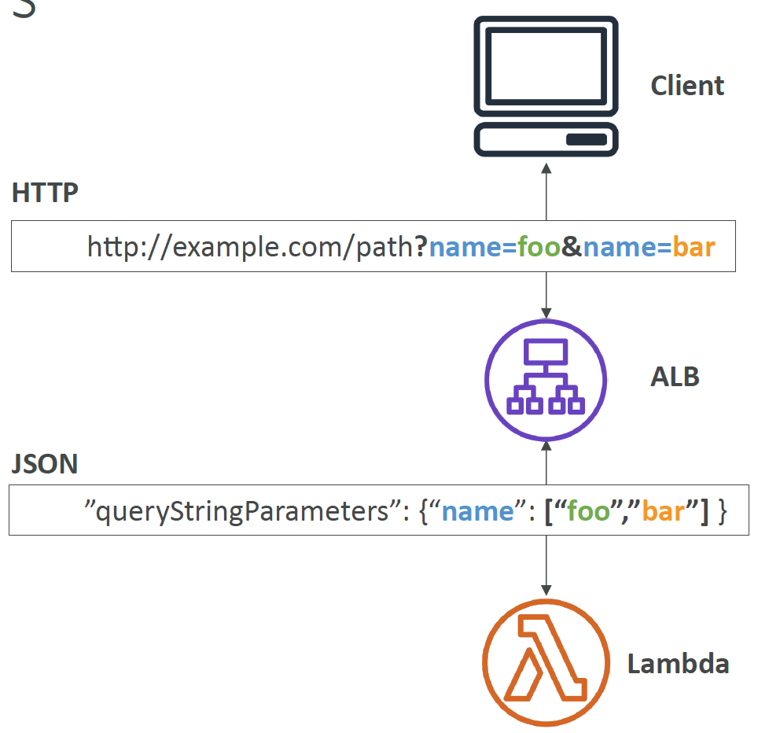
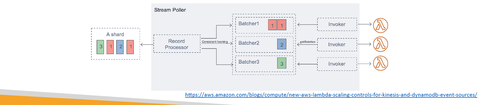

# Section 21: AWS Lambda
## Lambda
__Lambda – Synchronous Invocations__  
* __Synchronous__: CLI, SDK, API Gateway, Application Load Balancer
  - Results is returned right away
  - Error handling must happen client side (retries, exponential backoff, etc…)

__Lambda - Synchronous Invocations - Services__  
* User Invoked:
  - Elastic Load Balancing (Application Load Balancer)
  - Amazon API Gateway
  - Amazon CloudFront (Lambda@Edge)
  - Amazon S3 Batch
* Service Invoked:
  - Amazon Cognito
  - AWS Step Functions
* Other Services:
  - Amazon Lex
  - Amazon Alexa
  - Amazon Kinesis Data Firehose

__Lambda Integration with ALB__   
* To expose a Lambda function as an HTTP(S) endpoint…
* You can use the _Application Load Balancer_ (or an API Gateway)
* The Lambda function must be registered in a _target group_

__ALB Multi-Value Headers__  
* ALB can support multi-value headers (ALB setting)
* When you enable multi-value headers, _HTTP headers and query string parameters_ that are sent with _multiple values_ are shown _as arrays_ within the AWS Lambda event and response objects.
  

__Lambda – Asynchronous Invocations__  
* S3, SNS, CloudWatch Events…
* The events are placed in an _Event Queue_
* Lambda attempts to retry on errors
  - 3 tries total
  - 1 minute wait after 1st , then 2 minutes wait
* Make sure the processing is idempotent (in case of retries)
* If the function is retried, you will see _duplicate logs entries in CloudWatch Logs_
* Can define a DLQ (dead-letter queue) – _SNS or SQS_ – for failed processing (need correct IAM permissions)
* Asynchronous invocations allow you to speed up the processing if you don’t need to wait for the result (eg: you need 1000 files processed

__Lambda - Asynchronous Invocations - Services__  
* Amazon Simple Storage Service (S3)
* Amazon Simple Notification Service (SNS)
* Amazon CloudWatch Events / EventBridge
* AWS CodeCommit (CodeCommit Trigger: new branch, new tag, new push)
* AWS CodePipeline (invoke a Lambda function during the pipeline, Lambda must callback)
----- other -----
* Amazon CloudWatch Logs (log processing)
* Amazon Simple Email Service
* AWS CloudFormation
* AWS Config
* AWS IoT
* AWS IoT Events

__S3 Events Notifications__  
* `S3:ObjectCreated`, `S3:ObjectRemoved`, `S3:ObjectRestore`, `S3:Replication`…
* S3 event notifications typically deliver events in seconds but can sometimes take a minute or longer
* If two writes are made to a single non-versioned object at the same time, it is possible that only a single event notification will be sent
* If you want to ensure that an event notification is sent for every successful write, you can enable versioning on your bucket

__Lambda – Event Source Mapping__  
* Kinesis Data Streams
* SQS & SQS FIFO queue
* DynamoDB Streams
* Common denominator: records need to be polled from the source
* _Your Lambda function is invoked synchronously_

__Streams & Lambda (Kinesis & DynamoDB)__  
* An event source mapping creates an iterator for each shard, processes items in order
* Start with new items, from the beginning or from timestamp
* Processed items aren't removed from the stream (other consumers can read them)
* Low traffic: use batch window to accumulate records before processing
* You can process multiple batches in parallel
  - up to 10 batches per shard
  - in-order processing is still guaranteed for each partition key,

__Streams & Lambda – Error Handling__   
* _By default, if your function returns an error, the entire batch is reprocessed until the function succeeds, or the items in the batch expire._
* To ensure in-order processing, processing for the affected shard is paused until the error is resolved
* You can configure the event source mapping to:
  - discard old events
  - restrict the number of retries
  - split the batch on error (to work around Lambda timeout issues)
* Discarded events can go to a _Destination_

__Lambda – Event Source Mapping SQS & SQS FIFO__  
* Event Source Mapping will poll SQS (Long Polling)
* Specify batch size (1-10 messages)
* Recommended: Set the queue visibility timeout to 6x the timeout of your Lambda function
* To use a DLQ
  - set-up on the SQS queue, not Lambda (DLQ for Lambda is only for async invocations)
  - Or use a Lambda destination for failures

__Queues & Lambda__  
* Lambda also supports in-order processing for FIFO (first-in, first-out) queues, _scaling up to the number of active message groups._
* For standard queues, items aren't necessarily processed in order.
* Lambda scales up to process a standard queue as quickly as possible.
* When an error occurs, batches are returned to the queue as individual items
and might be processed in a different grouping than the original batch.
* Occasionally, the event source mapping might receive the same item from
the queue twice, even if no function error occurred.
* Lambda deletes items from the queue after they're processed successfully.
* You can configure the source queue to send items to a dead-letter queue if
they can't be processed

__Lambda Event Mapper Scaling__   
* __Kinesis Data Streams & DynamoDB Streams:__
  - One Lambda invocation per stream shard
  - If you use parallelization, up to 10 batches processed per shard simultaneously
* __SQS Standard:__
  - Lambda adds 60 more instances per minute to scale up
  - Up to 1000 batches of messages processed simultaneously
* __SQS FIFO:__
  - Messages with the same GroupID will be processed in order
  - The Lambda function scales to the number of active message groups

__Lambda – Destinations__  
* __Asynchronous invocations__ - can define destinations for successful and failed event:
  - Amazon SQS
  - Amazon SNS
  - AWS Lambda
  - Amazon EventBridge bus
* Note: AWS recommends you use destinations instead of DLQ now (but both can be used at the same time)
* __Event Source mapping__: for discarded event batches
  - Amazon SQS
  - Amazon SNS
* Note: you can send events to a DLQ directly from SQS

__Lambda Execution Role (IAM Role)__  
* Grants the Lambda function permissions to AWS services / resources
* Sample managed policies for Lambda:
  - `AWSLambdaBasicExecutionRole` – Upload logs to CloudWatch.
  - `AWSLambdaKinesisExecutionRole` – Read from Kinesis
  - `AWSLambdaDynamoDBExecutionRole` – Read from DynamoDB Streams
  - `AWSLambdaSQSQueueExecutionRole` – Read from SQS
  - `AWSLambdaVPCAccessExecutionRole` – Deploy Lambda function in VPC
  - `AWSXRayDaemonWriteAccess` – Upload trace data to X-Ray.
* When you use an event source mapping to invoke your function, Lambda uses the execution role to read event data.
* Best practice: create one Lambda Execution Role per function
