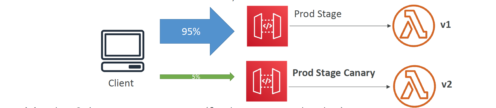

# Section 23: Amazon API Gateway

__API Gateway – Integrations High Level__  
* __Lambda Function__
  - Invoke Lambda function
  - Easy way to expose REST API backed by AWS Lambda
* __HTTP__
  - Expose HTTP endpoints in the backend
  - Example: internal HTTP API on premise, Application Load Balancer…
  - Why? Add rate limiting, caching, user authentications, API keys, etc…
* __AWS Service__
  - Expose any AWS API through the API Gateway
  - Example: start an AWS Step Function workflow, post a message to SQS
  - Why? Add authentication, deploy publicly, rate control…

__API Gateway - Endpoint Types__
* __Edge-Optimized (default):__ For global clients
  - Requests are routed through the CloudFront Edge locations (improves latency)
  - The API Gateway still lives in only one region
* __Regional:__
  - For clients within the same region
  - Could manually combine with CloudFront (more control over the caching strategies and the distribution)
* __Private:__
  - Can only be accessed from your VPC using an interface VPC endpoint (ENI)
  - Use a resource policy to define access

__API Gateway – Security__  
* __User Authentication through__
  - IAM Roles (useful for internal applications)
  - Cognito (identity for external users – example mobile users)
  - Custom Authorizer (your own logic)
* __Custom Domain Name HTTPS__ security through integration with AWS Certificate Manager (ACM)
  - If using _Edge-Optimized endpoint_, then the certificate must be in `us-east-1`
  - If using Regional endpoint, the certificate must be in the API Gateway region
  - Must setup CNAME or A-alias record in Route 53

__API Gateway – Deployment Stages__  
* Making changes in the API Gateway does not mean they’re effective
* You need to make a “deployment” for them to be in effect
* It’s a common source of confusion
* Changes are deployed to “Stages” (as many as you want)
* Use the naming you like for stages (dev, test, prod)
* Each stage has its own configuration parameters
* Stages can be rolled back as a history of deployments is kept

__API Gateway – Stage Variables__  
* Stage variables are like environment variables for API Gateway
* Use them to change often changing configuration values
* They can be used in:
  - Lambda function ARN
  - HTTP Endpoint
  - Parameter mapping templates
* Use cases:
  - Configure HTTP endpoints your stages talk to (dev, test, prod…)
  - Pass configuration parameters to AWS Lambda through mapping templates
* Stage variables are passed to the ”context” object in AWS Lambda
* `Format: ${stageVariables.variableName}`

__API Gateway – Canary Deployment__  
* Possibility to enable canary deployments for any stage (usually prod)
* Choose the % of traffic the canary channel receives
* Metrics & Logs are separate (for better monitoring)
* Possibility to override stage variables for canary
* This is blue / green deployment with AWS Lambda & API Gateway

