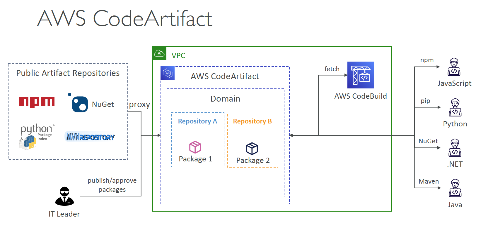
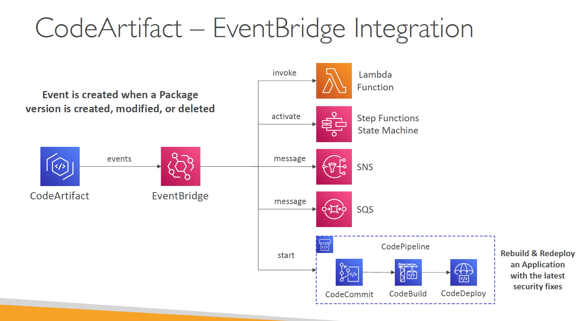

# Section 24: AWS CICD
__CICD – Introduction__  
* __AWS CodeCommit__ – storing our code
* __AWS CodePipeline__ – automating our pipeline from code to Elastic Beanstalk
* __AWS CodeBuild__ – building and testing our code
* __AWS CodeDeploy__ – deploying the code to EC2 instances (not Elastic Beanstalk)
* __AWS CodeStar__ – manage software development activities in one place
* __AWS CodeArtifact__ – store, publish, and share software packages
* __AWS CodeGuru__ – automated code reviews using Machine Learning

## AWS CodeCommit
__CodeCommit – Security__   
* Interactions are done using Git (standard)
* __Authentication__
  - __SSH Keys__ – AWS Users can configure SSH keys in their IAM Console
  - __HTTPS__ – with AWS CLI Credential helper or Git Credentials for IAM user
* __Authorization__
  - IAM policies to manage users/roles permissions to repositories
* __Encryption__
  - Repositories are automatically encrypted at rest using AWS KMS
  - Encrypted in transit (can only use HTTPS or SSH – both secure)
* __Cross-account Access__  
  - Do NOT share your SSH keys or your AWS credentials
  - Use an IAM Role in your AWS account and use AWS STS (`AssumeRole` API)

__CodeCommit – Important – Deprecation__  
* On July 25th 2024, AWS abruptly discontinued CodeCommit
* New customers cannot use the service
* AWS recommends to migrate to an external Git solution

* For this course:
  - CodeCommit might still appear at the exam (for now)
  - Anytime I use CodeCommit, please use GitHub instead (we set it up once together)
  - Every time I mention CodeCommit, assume there’s a GitHub integration

## AWS CodePipeline
__Introduction__  
* Visual Workflow to orchestrate your CICD
* __Source__ – CodeCommit, ECR, S3, Bitbucket, GitHub
* __Build__ – CodeBuild, Jenkins, CloudBees, TeamCity
* __Test__ – CodeBuild, AWS Device Farm, 3rd party tools
* __Deploy__ – CodeDeploy, Elastic Beanstalk, CloudFormation, ECS, S3, etc
* __Invoke__ – Lambda, Step Functions
* Consists of stages:
  - Each stage can have sequential actions and/or parallel actions
  - Example: Build -> Test -> Deploy -> Load Testing -> etc
  - Manual approval can be defined at any stage

__CodePipeline – Artifacts__  
* Each pipeline stage can create artifacts
* Artifacts stored in an S3 bucket and passed on to the next stage

__CodePipeline – Troubleshooting__  
* For CodePipeline Pipeline/Action/Stage Execution State Changes
* Use CloudWatch Events (Amazon EventBridge). Example:
  - You can create events for failed pipelines
  - You can create events for cancelled stages
* If CodePipeline fails a stage, your pipeline stops, and you can get information in the console
* If pipeline can’t perform an action, make sure the _IAM Service Role_ attached does have enough IAM permissions (IAM Policy)
* AWS CloudTrail can be used to audit AWS API calls

## AWS CodeBuild
__Introduction__  
* __Source__ – CodeCommit, S3, Bitbucket, GitHub
* __Build instructions:__ Code file `buildspec.yml` or insert manually in Console or CloudFormation template.
* __Output logs__ can be stored in Amazon S3 and CloudWatch Logs
* Use CloudWatch Metrics to monitor build statistics
* Use EventBridge to detect failed builds and trigger notifications
* Use CloudWatch Alarms to notify if you need “thresholds” for failures
* Build Projects can be defined within CodePipeline or CodeBuild

## AWS CodeDeploy
__Introduction__  
* Deployment service that automates application deployment
* Deploy new applications versions to EC2 Instances, On-premises servers, Lambda functions, ECS Services
* Automated Rollback capability in case of failed deployments, or trigger CloudWatch Alarm
* Gradual deployment control
* A file named `appspec.yml` defines how the deployment happens

__CodeDeploy – EC2/On-premises Platform__  
* Can deploy to EC2 Instances & on-premises servers
* Perform in-place deployments or blue/green deployments
* Must run the __CodeDeploy Agent__ on the target instances
* Define deployment speed
  - __AllAtOnce__: most downtime
  - __HalfAtATime__: reduced capacity by 50%
  - __OneAtATime__: slowest, lowest availability impact
  - __Custom__: define your %

__CodeDeploy Agent__  
* The CodeDeploy Agent must be running on the EC2 instances as a prerequisites
* It can be installed and updated automatically if you’re using Systems Manager
* The EC2 Instances must have sufficient permissions to access Amazon S3 to get deployment bundles

__CodeDeploy – Lambda Platform__  
* __CodeDeploy__ can help you automate traffic shift for Lambda aliases
* Feature is integrated within the SAM framework
* __Linear__: grow traffic every N minutes until 100%
  - LambdaLinear10PercentEvery3Minutes
  - LambdaLinear10PercentEvery10Minutes
* __Canary__: try X percent then 100%
  - LambdaCanary10Percent5Minutes
  - LambdaCanary10Percent30Minutes
* __AllAtOnce__: immediate

__CodeDeploy – ECS Platform__    
* __CodeDeploy__ can help you automate the deployment of a new ECS Task Definition
* Only Blue/Green Deployments
* __Linear__: grow traffic every N minutes until 100%
  - ECSLinear10PercentEvery3Minutes
  - ECSLinear10PercentEvery10Minutes
* __Canary__: try X percent then 100%
  - ECSCanary10Percent5Minutes
  - ECSCanary10Percent30Minutes
* __AllAtOnce__: immediate

__CodeDeploy – Deployment to EC2__  
* Define how to deploy the application using `appspec.yml` + Deployment Strategy
* Will do In-place update to your fleet of EC2 instances
* Can use hooks to verify the deployment after each deployment phase

__CodeDeploy – Deploy to an ASG__  
* __In-place Deployment__
  - Updates existing EC2 instances
  - Newly created EC2 instances by an ASG will also get automated deployments
* __Blue/Green Deployment__  
  - A new Auto-Scaling Group is created (settings are copied)
  - Choose how long to keep the old EC2 instances (old ASG)
  - Must be using an ELB

__CodeDeploy – Redeploy & Rollbacks__  
* Rollback = redeploy a previously deployed revision of your application
* Deployments can be rolled back:
  - __Automatically__ – rollback when a deployment fails or rollback when a CloudWatch Alarm thresholds are met
  - __Manually__
* Disable Rollbacks — do not perform rollbacks for this deployment
* If a roll back happens, CodeDeploy redeploys the last known good
revision as a new deployment (not a restored version)

#### Code Deploy LifeCycle Hooks
__For EC2 / On-Premises Deployments__  
When you deploy an application to an EC2 instance or on-prem server, CodeDeploy runs hooks in this order:
1. ApplicationStop
  - Run before the new version is installed.
  - Typically stops the current application or service.
2. DownloadBundle (not a hook, CodeDeploy action)
  - CodeDeploy agent downloads the revision bundle.
3. BeforeInstall
 - Prepare the instance (e.g., backup files, install dependencies).
4. Install (not a hook, CodeDeploy action)
  - CodeDeploy agent copies the new revision to the instance.
5. AfterInstall
  - Final tweaks (e.g., change file permissions, config setup).
6. ApplicationStart
  - Start the new application or service.
7. ValidateService
  - Run validation tests to ensure the deployment succeeded.

The following code snippet shows a valid example of the structure of hooks for an _EC2/on-premise_ deployment:
```yaml
Hooks:
  - ApplicationStop: "LambdaFunction"
  - BeforeInstall: "LambdaFunctionToValidateBeforeInstall"
  - AfterInstall: "LambdaFunctionToValidateAfterInstall"
  - ApplicationStart: "LambdaFunctionToStartTheApplication"
  - ValidateService: "LambdaFunctionToValidateService"
```

__For ECS Deployments (Blue/Green or Rolling)__  
ECS deployments have fewer hooks since the lifecycle is containerized:
1. BeforeInstall
  - Runs before the new task set is created.
2. AfterInstall
  - Runs after the new task set is created, but before traffic is shifted.
3. AfterAllowTestTraffic (only for blue/green)
  - Runs after test traffic is routed to the new task set.
4. BeforeAllowTraffic
  - Runs before shifting production traffic to the new task set.
5. AfterAllowTraffic
  - Runs after production traffic has been shifted.


The following code snippet shows a valid example of the structure of hooks for an _Amazon ECS_ deployment:
```yaml
Hooks:
  - BeforeInstall: "LambdaFunctionToValidateBeforeInstall"
  - AfterInstall: "LambdaFunctionToValidateAfterTraffic"
  - BeforeAllowTestTraffic: "LambdaFunctionToValidateAfterTestTrafficStarts"
  - BeforeAllowTraffic: "LambdaFunctionToValidateBeforeAllowingProductionTraffic"
  - AfterAllowTraffic: "LambdaFunctionToValidateAfterAllowingProductionTraffic"
```


__Code Deploy Blue Green Deployment__  
A Blue/Green deployment is used to update your applications while minimizing interruptions caused by the changes of a new application version.  
CodeDeploy provisions your new application version alongside the old version before rerouting your production traffic. The behavior of your deployment depends on which compute platform you use:

1. __AWS Lambda__: Traffic is shifted from one _version_ of a Lambda function to a _new version_ of the same Lambda function.
2. __Amazon ECS__: Traffic is shifted from a _task set_ in your Amazon ECS service to an updated, replacement task set in the same Amazon ECS service.
3. __EC2/On-Premises__: Traffic is shifted from one _set of instances_ in the original environment to a replacement set of instances.

## AWS CodeArtifact
__Introduction__  
* Software packages depend on each other to be built (also called code dependencies), and new ones are created
* Storing and retrieving these dependencies is called __artifact management__
* Traditionally you need to setup your own artifact management system
* __CodeArtifact__ is a secure, scalable, and cost-effective artifact management for software development
* Works with common dependency management tools such as _Maven_, _Gradle_, _npm_, _yarn_, _twine_, _pip_, and _NuGet_
* Developers and CodeBuild can then retrieve dependencies straight
from CodeArtifact



__CodeArtifact – EventBridge Integration__
  

__CodeArtifact – Resource Policy__   
* Can be used to authorize another account to access CodeArtifact
* A given principal can either read all the packages in a repository or none of them

## Amazon CodeGuru
__Introduction__  
* An ML-powered service for __automated code reviews__ and __application performance recommendations__
* Provides two functionalities
  - __CodeGuru Reviewer__: automated code reviews for static code analysis (development)
  - __CodeGuru Profiler__: visibility/recommendations about application performance during runtime (production)

__Amazon CodeGuru Reviewer__  
* Identify critical issues, security vulnerabilities, and hard-to-find bugs
* Example: common coding best practices, resource leaks, security detection, input validation
* Uses Machine Learning and automated reasoning
* Hard-learned lessons across millions of code reviews on 1000s of open-source and Amazon repositories
* Supports Java and Python
* Integrates with GitHub, Bitbucket, and AWS CodeCommit

__Amazon CodeGuru Profiler__  
* Helps understand the runtime behavior of your application
* Example: identify if your application is consuming excessive CPU capacity on a logging routine
* Features:
  - Identify and remove code inefficiencies
  - Improve application performance (e.g., reduce CPU utilization)
  - Decrease compute costs
  - Provides heap summary (identify which objects using up memory)
  - Anomaly Detection
* Support applications running on AWS or on-premise
* Minimal overhead on application

__Amazon CodeGuru – Agent Configuration__  
* __MaxStackDepth__ – the maximum depth of the stacks in the code that is represented in the profile
  - Example: if CodeGuru Profiler finds a method A, which calls method B, which calls method C, which calls method D, then the depth is 4
  - If the MaxStackDepth is set to 2, then the profiler evaluates A and B
* __MemoryUsageLimitPercent__ – the memory percentage used by the profiler
* __MinimumTimeForReportingInMilliseconds__ – the minimum time between sending reports (milliseconds)
* __ReportingIntervalInMilliseconds__ – the reporting interval used to report profiles (milliseconds)
* __SamplingIntervalInMilliseconds__ – the sampling interval that is used to profile samples (milliseconds)
  - Reduce to have a higher sampling rate
