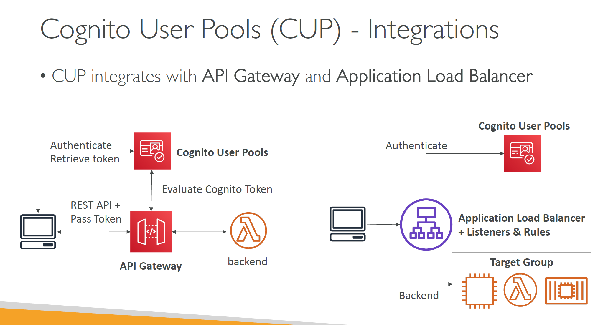
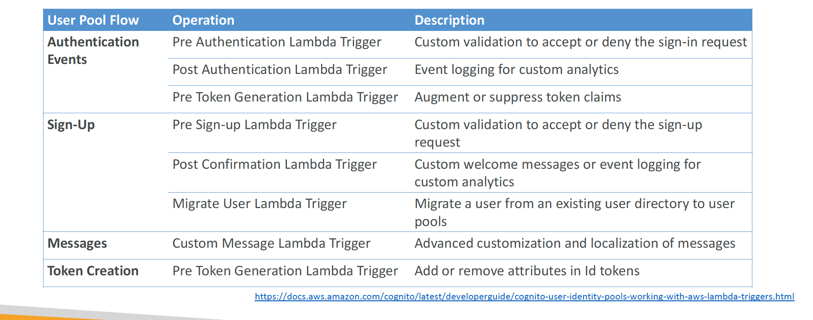

# Section 27: Amazon Cognito
__Cognito User Pools (CUP) - Integrations__

__Cognito User Pools – Lambda Triggers__  
* CUP can invoke a Lambda function synchronously on these triggers:
  

__CUP – Hosted UI Custom Domain__  
* For custom domains, you must create an ACM certificate in us-east-1
* The custom domain must be defined in the “App Integration” section

__CUP – Adaptive Authentication__  
* Block sign-ins or require MFA if the login appears
suspicious
* Cognito examines each sign-in attempt and generates a risk score (low, medium, high) for how likely the sign-in request is to be from a malicious attacker
* Users are prompted for a second MFA only when risk is detected
* Risk score is based on different factors such as if the user has used the same device, location, or IP address
* Checks for compromised credentials, account takeover
protection, and phone and email verification
* Integration with CloudWatch Logs (sign-in attempts, risk score, failed challenges…)

__Application Load Balancer – Authenticate Users__   
* Your Application Load Balancer can securely authenticate users
  - Offload the work of authenticating users to your load balancer
  - Your applications can focus on their business logic
* Authenticate users through:
  - Identity Provider (IdP): OpenID Connect (OIDC) compliant
  - Cognito User Pools:
    * Social IdPs, such as Amazon, Facebook, or Google
    * Corporate identities using SAML, LDAP, or Microsoft AD
* _Must use an HTTPS listener to set authenticate-oidc & authenticate-cognito rules_
* `OnUnauthenticatedRequest` – authenticate (default), deny, allow

__Cognito User Pools vs Identity Pools__  
* __Cognito User Pools (for authentication = identity verification)__
  - Database of users for your web and mobile application
  - Allows to federate logins through Public Social, OIDC, SAML…
  - Can customize the hosted UI for authentication (including the logo)
  - Has triggers with AWS Lambda during the authentication flow
  - Adapt the sign-in experience to different risk levels (MFA, adaptive authentication, etc…)
* __Cognito Identity Pools (for authorization = access control)__
  - Obtain AWS credentials for your users
  - Users can login through Public Social, OIDC, SAML & Cognito User Pools
  - Users can be unauthenticated (guests)
  - Users are mapped to IAM roles & policies, can leverage policy variables
* __CUP + CIP = authentication + authorization__
