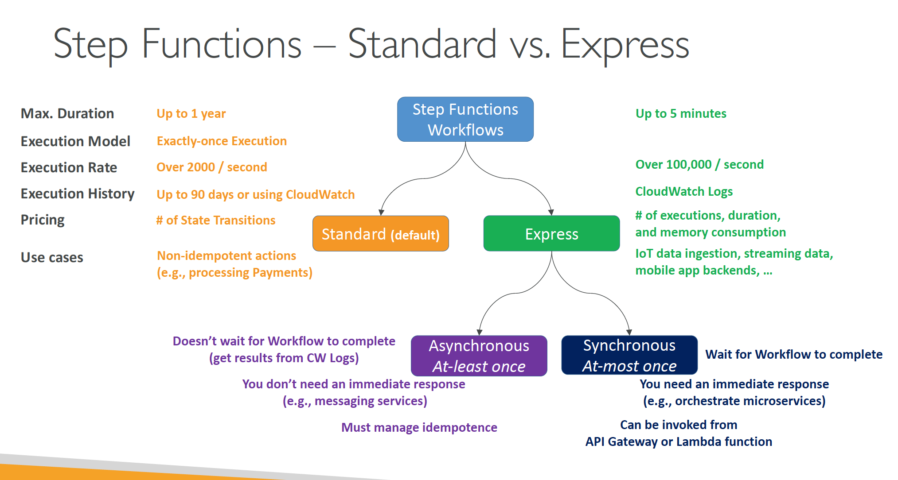

# Section 28: Other Serverless - Step Functions, App Sync

## Step Functions
__Step Function – Task States__
* Do some work in your state machine
* Invoke one AWS service
  - Can invoke a Lambda function
  - Run an AWS Batch job
  - Run an ECS task and wait for it to complete
  - Insert an item from DynamoDB
  - Publish message to SNS, SQS
  - Launch another Step Function workflow…
* Run an one Activity
  - EC2, Amazon ECS, on-premises
  - Activities poll the Step functions for work
  - Activities send results back to Step Functions

__Step Function - States__  
* __Choice State__ - Test for a condition to send to a branch (or default branch)
* __Fail or Succeed State__ - Stop execution with failure or success
* __Pass State__ - Simply pass its input to its output or inject some fixed data, without performing work.
* __Wait State__ - Provide a delay for a certain amount of time or until a specified time/date.
* __Map State__ - Dynamically iterate steps.’
* __Parallel State__ - Begin parallel branches of execution

__Step Functions – Wait for Task Token__   
* Allows you to pause Step Functions during a Task until a Task Token is returned
* Task might wait for other AWS services, human approval, 3rd party integration, call legacy systems…
* Append `.waitForTaskToken` to the Resource field to tell Step Functions to wait for the Task Token to be returned
```json
"Resource": "arn:aws:states:::sqs:sendMessage.waitForTaskToken"
```
* Task will pause until it receives that Task Token back with a `SendTaskSuccess` or `SendTaskFailure` API call

__Step Functions – Activity Tasks__  
* Enables you to have the Task work performed by an _Activity Worker_
* _Activity Worker_ apps can be running on EC2, Lambda,
mobile device…
* Activity Worker poll for a Task using `GetActivityTask` API
* After Activity Worker completes its work, it sends a
response of its success/failure using `SendTaskSuccess` or
`SendTaskFailure`
* To keep the Task active:
  - Configure how long a task can wait by setting `TimeoutSeconds`
  - Periodically send a heartbeat from your Activity Worker using `SendTaskHeartBeat` within the time you set in `HeartBeatSeconds`
* By configuring a long `TimeoutSeconds` and actively
sending a heartbeat, Activity Task can wait up to 1 year

__State Machine Type – Standard vs. Express__  
  

## AWS AppSync
__AWS AppSync - Overview__  
* _AppSync_ is a managed service that uses _GraphQL_
* _GraphQL_ makes it easy for applications to get exactly the data they need.
* This includes combining data from _one or more sources_
  - NoSQL data stores, Relational databases, HTTP APIs…
  - Integrates with DynamoDB, Aurora, OpenSearch & others
  - Custom sources with AWS Lambda
* Retrieve data in _real-time with WebSocket or MQTT on WebSocket_
* For mobile apps: local data access & data synchronization
* It all starts with uploading one _GraphQL schema_
