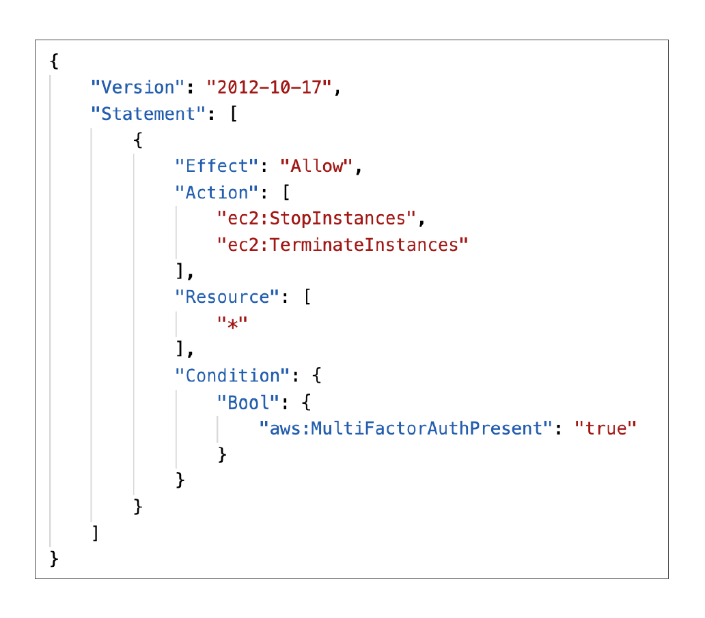
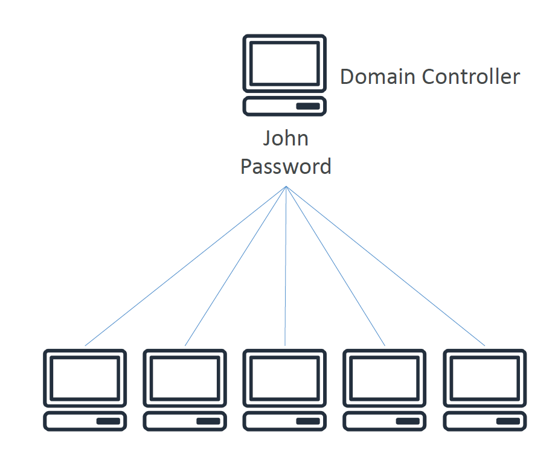
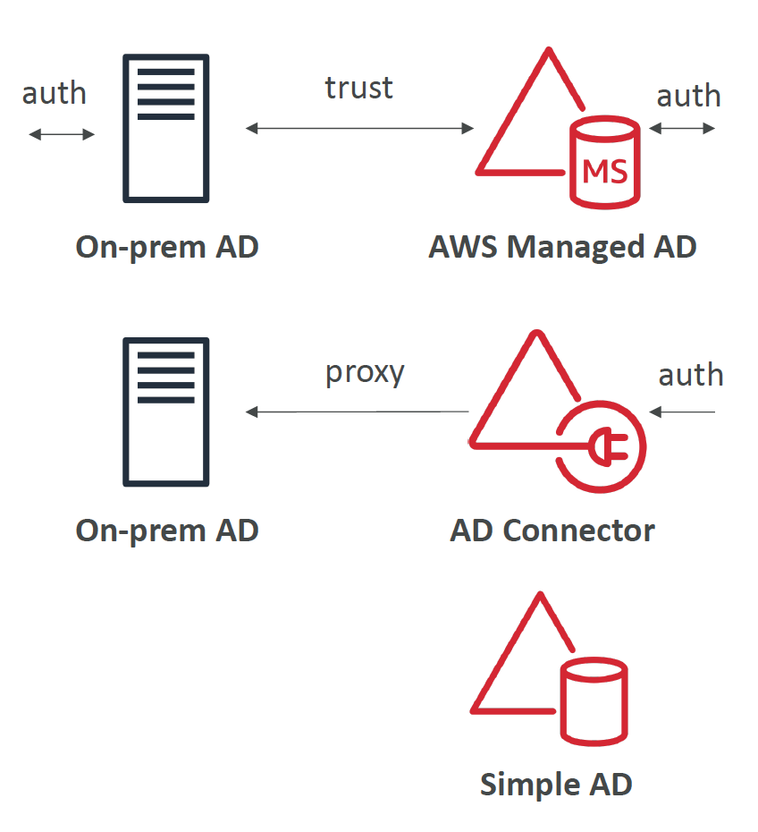

# Section 29: Advanced Identity
__AWS STS – Security Token Service__    
* Allows to grant limited and temporary access to AWS resources (up to 1 hour).
* `AssumeRole`: Assume roles within your account or cross account
* `AssumeRoleWithSAML`: return credentials for users logged with SAML
* `AssumeRoleWithWebIdentity`
  - return creds for users logged with an IdP (Facebook Login, Google Login, OIDC compatible…)
  - AWS recommends against using this, and using Cognito Identity Pools instead
* `GetSessionToken`: for MFA, from a user or AWS account root user
* `GetFederationToken`: obtain temporary creds for a federated user
* `GetCallerIdentity`: return details about the IAM user or role used in the API call
* `DecodeAuthorizationMessage`: decode error message when an AWS API is denied

__STS with MFA__  
* Use `GetSessionToken` from STS
* Appropriate IAM policy using
IAM Conditions
* `aws:MultiFactorAuthPresent:true`
* Reminder, `GetSessionToken` returns:
  - Access ID
  - Secret Key
  - Session Token
  - Expiration date
   

## Active Directory
__What is Microsoft Active Directory (AD)?__  
* Found on any Windows Server with AD Domain Services
* Database of objects: User Accounts, Computers, Printers, File Shares, Security Groups
* Centralized security management, create account, assign permissions
* Objects are organized in _trees_
* A group of trees is a _forest_

__AWS Directory Services__
* __AWS Managed Microsoft AD__
  - Create your own AD in AWS, manage users locally, supports MFA
  - Establish “trust” connections with your on-premise AD
* __AD Connector__
  - Directory Gateway (proxy) to redirect to on-premise AD, supports MFA
  - Users are managed on the on-premise AD
* __Simple AD__
  - AD-compatible managed directory on AWS
  - Cannot be joined with on-premise AD

