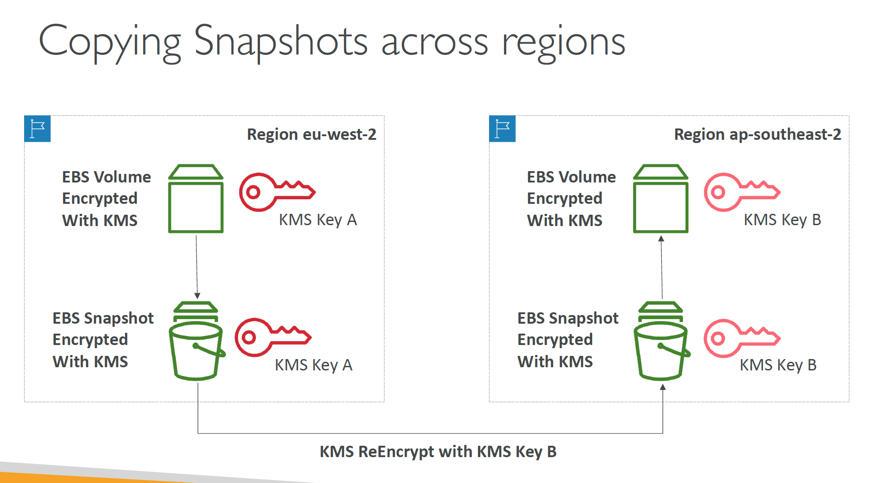
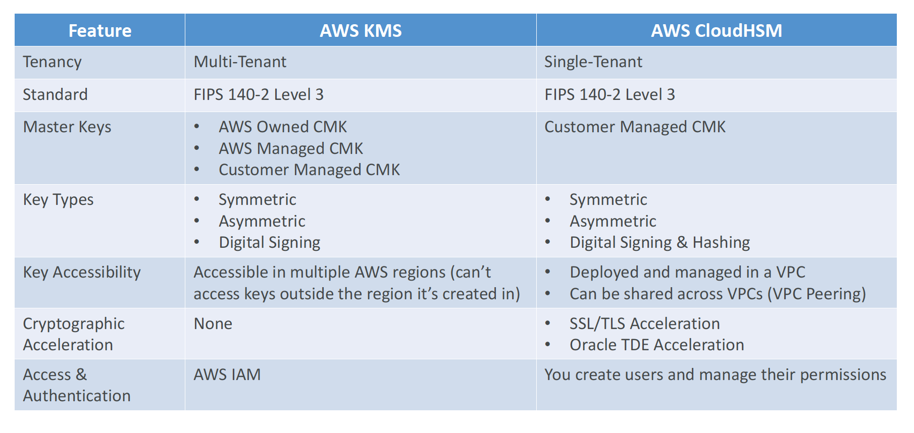
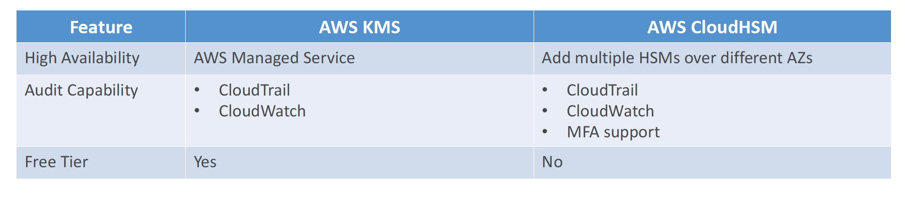
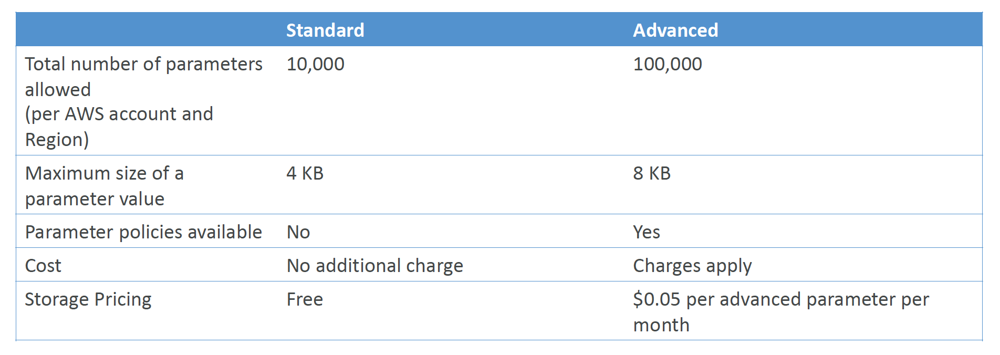
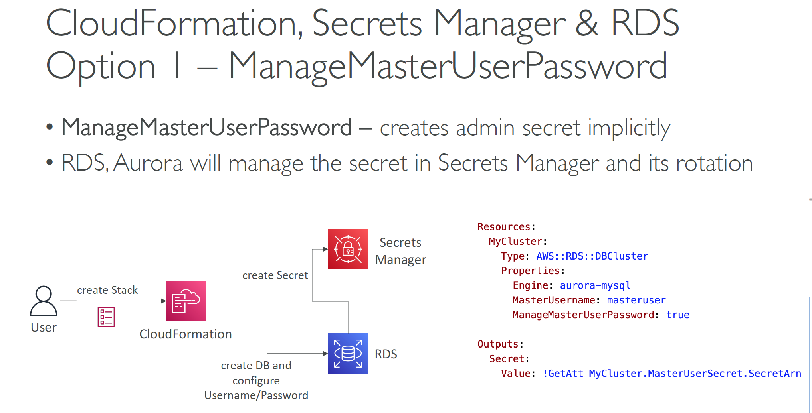
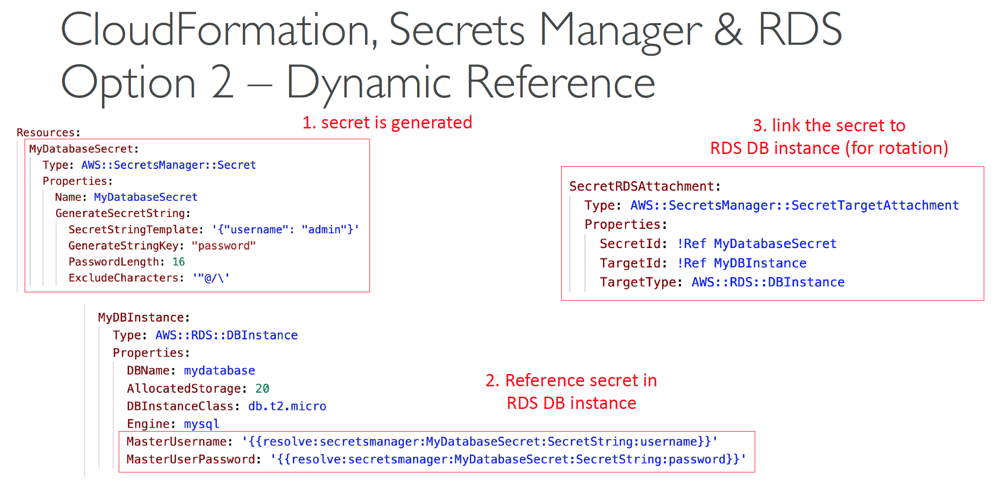

# Section 30: AWS Security And Encryption
## AWS KMS
__KMS Keys Types__
* __KMS Keys is the new name of KMS Customer Master Key__
* __Symmetric (AES-256 keys)__
  - Single encryption key that is used to Encrypt and Decrypt
  - AWS services that are integrated with KMS use Symmetric CMKs
  - You never get access to the KMS Key unencrypted (must call KMS API to use)
* __Asymmetric (RSA & ECC key pairs)__
  - Public (Encrypt) and Private Key (Decrypt) pair
  - Used for Encrypt/Decrypt, or Sign/Verify operations
  - The public key is downloadable, but you can’t access the Private Key unencrypted
  - Use case: encryption outside of AWS by users who can’t call the KMS API

__AWS KMS (Key Management Service)__
* Types of KMS Keys:
  - AWS Owned Keys (free): SSE-S3, SSE-SQS, SSE-DDB (default key)
  - AWS Managed Key: free (aws/service-name, example: aws/rds or aws/ebs)
  - Customer managed keys created in KMS: $1 / month
  - Customer managed keys imported: $1 / month
  - + pay for API call to KMS ($0.03 / 10000 calls)
* Automatic Key rotation:
  - AWS-managed KMS Key: automatic every 1 year
  - Customer-managed KMS Key: (must be enabled) automatic & on-demand
  - Imported KMS Key: only manual rotation possible using alias

__Copying Snapshots across regions__  


__KMS Key Policies__
* Control access to KMS keys, “similar” to S3 bucket policies
* Difference: you cannot control access without them
* Default KMS Key Policy:
  - Created if you don’t provide a specific KMS Key Policy
  - Complete access to the key to the root user = entire AWS account
* Custom KMS Key Policy:
  - Define users, roles that can access the KMS key
  - Define who can administer the key
  - Useful for cross-account access of your KMS key

__Copying Snapshots across accounts__
1. Create a Snapshot, encrypted with your own KMS Key (Customer Managed Key)
2. Attach a KMS Key Policy to authorize cross-account access
3. Share the encrypted snapshot
4. (in target) Create a copy of the Snapshot, encrypt it with a CMK in your account
5. Create a volume from the snapshot KMS
6. See the `kms-key-policy.json` for cross account key policy

__Envelope Encryption__  
* KMS Encrypt API call has a limit of _4KB_
* If you want to encrypt > 4KB, we need to use _Envelope Encryption_
* The main API that will help us is the `GenerateDataKey` API
* _For the exam: anything over 4KB of data that needs to be encrypted must use the Envelope Encryption == GenerateDataKey API_  

__KMS Symmetric – API Summary__  
* __Encrypt__: encrypt up to 4 KB of data through KMS
* __GenerateDataKey__: generates a unique symmetric data key (DEK)
  - returns a plaintext copy of the data key
  - AND a copy that is encrypted under the CMK that you specify
* __GenerateDataKeyWithoutPlaintext:__
  - Generate a DEK to use at some point (not immediately)
  - DEK that is encrypted under the CMK that you specify (must use Decrypt later)
* __Decrypt:__ decrypt up to 4 KB of data (including Data Encryption Keys)
* __GenerateRandom:__ Returns a random byte string

__Principal Options in IAM Policies__  
* __AWS Account and Root User__
```json
"Principal": {"AWS": "12345678910"}
"Principal": {"AWS": "arn:aws:iam::12345678910:root"}
```
* __IAM Roles__
```json
"Principal": {"AWS": "arn:aws:iam::12345678910:role/role-name"}
```
* __IAM Role Sessions__  
```json
"Principal": {"AWS": "arn:aws:iam::12345678910:assumed-role/role-name/role-session-name"}
"Principal": {"Federated": "cognito-identity.amazonaws.com"}
"Principal": {"Federated": "arn:aws:iam::12345678910:saml-provider/provider-name"}
```
* __IAM Users__  
```json
"Principal": {"AWS": "arn:aws:iam::12345678910:user/user-name"}
```
* __Federated User Sessions__  
```json
"Principal": {"AWS": "arn:aws:sts::12345678910:federated-user/user-name"}
```
* __AWS Services__  
```json
"Principal": {
  "Services": [
    "ecs.amazonaws.com",
    "elasticloadbalancing.amazonaws.com"
  ]
}
```
* __All Principals__  
```json
"Principal": "*"
"Principal": {"AWS": "*"}
```

## CloudHSM
* KMS => AWS manages the software for encryption
* CloudHSM => AWS provisions encryption _hardware_
* Dedicated Hardware (HSM = _Hardware Security Module_)
* You manage your own encryption keys entirely (not AWS)
* HSM device is tamper resistant, FIPS 140-2 Level 3 compliance
* Supports both symmetric and asymmetric encryption (SSL/TLS keys)
* No free tier available
* Must use the CloudHSM Client Software
* Redshift supports CloudHSM for database encryption and key management
* _Good option to use with SSE-C encryption_

__CloudHSM vs KMS__  



## SSM Parameter Store
* Secure storage for configuration and secrets
* Optional Seamless Encryption using KMS
* Serverless, scalable, durable, easy SDK
* Version tracking of configurations / secrets
* Security through IAM
* Notifications with Amazon EventBridge
* Integration with CloudFormation

__SSM Parameter Store Hierarchy__
- /my-department/
  - my-app/
    - dev/
    - db-url
    - db-password

`GetParameters` or `GetParametersByPath` API

__Standard and advanced parameter tiers__  



#### Parameters Policies (for advanced parameters)
* Allow to assign a TTL to a parameter (expiration date) to force
updating or deleting sensitive data such as passwords
* Can assign multiple policies at a time

__Expiration (to delete a parameter)__
```json
{
  "Type": "Expiration",
  "Version": "1.0",
  "Attributes": {
    "Timestamp": "2020-12-02T21:34:33.000z"
  }
}
```

__ExpirationNotification (EventBridge__  
```json
{
  "Type": "ExpirationNotification",
  "Version": "1.0",
  "Attributes": {
    "Before": "15",
    "Unit": "Days"
  }
}
```

__NoChangeNotification (EventBridge)__  
```json
{
  "Type": "NoChangeNotification",
  "Version": "1.0",
  "Attributes": {
    "After": "20",
    "Unit": "Days"
  }
}
```

## AWS Secrets Manager
* Newer service, meant for storing secrets
* Capability to force _rotation of secrets_ every X days
* Automate generation of secrets on rotation (uses Lambda)
* Integration with __Amazon RDS__ (MySQL, PostgreSQL, Aurora)
* Secrets are encrypted using KMS
* Mostly meant for RDS integration

__AWS Secrets Manager – Multi-Region Secrets__  
* Replicate Secrets across multiple AWS Regions
* Secrets Manager keeps read replicas in sync with the primary Secret
* Ability to promote a read replica Secret to a standalone Secret
* Use cases: multi-region apps, disaster recovery strategies, multi-region DB

__SSM Parameter Store vs Secrets Manager__  
* __Secrets Manager ($$$):__
  - Automatic rotation of secrets with AWS Lambda
  - Lambda function is provided for RDS, Redshift, DocumentDB
  - KMS encryption is mandatory
  - Can integration with CloudFormation
* __SSM Parameter Store ($):__
  - Simple API
  - No secret rotation (can enable rotation using Lambda triggered by EventBridge)
  - KMS encryption is optional
  - Can integration with CloudFormation
  - Can pull a Secrets Manager secret using the SSM Parameter Store API

__CloudFormation – Dynamic References__  
Reference external values stored in _Systems Manager Parameter Store_ and _Secrets Manager_ within CloudFormation templates

__SSM__  
Syntax: `{{resolve:ssm:parameter-name:version}}`
```yaml
Resources:
  S3Bucket:
    Type: AWS::S3::Bucket  
    Properties:
      AccessControl: '{{resolve:ssm:S3AccessControl:2}}'
```

__SSM Secure__    
Syntax: `{{resolve:ssm-secure:parameter-name:version}}`
```yaml
Resources:
  IamUser:
    Type: AWS::IAM::User
    Properties:
      UserName: john
      LoginProfile:
        Password: '{{resolve:ssm-secure:IAMUserPassword:10}}'
```

__Secrets Manager__     
Syntax: `{{resolve:secretsmanager:secret-id:secret:json:version-stage:version-id}}`
```yaml
Resources:
  DbInstance:
    Type: AWS::RDS::DBInstance
    Properties:
      DBName: MyDbInstance
      MasterUsername: '{{resolve:secretsmanager:MyRdsSecret:SecretString:username}}'
      MasterUserPassword: '{{resolve:secretsmanager:MyRdsSecret:SecretString:password}}'
```

__CloudFormation, Secrets Manager & RDS Option 1 – ManageMasterUserPassword__  
  

__CloudFormation, Secrets Manager & RDS Option 2 – Dynamic Reference__  


__CloudWatch Logs - Encryption__  
* You can encrypt CloudWatch logs with KMS keys
* Encryption is enabled at the log group level, by associating a CMK with a
log group, either when you create the log group or after it exists.
* You cannot associate a CMK with a log group using the CloudWatch
console.
* You must use the CloudWatch Logs API:
  - `associate-kms-key` : if the log group already exists
  - `create-log-group`: if the log group doesn’t exist yet

__CodeBuild Security__  
* To access resources in your VPC, make sure you specify a VPC
configuration for your CodeBuild
* Secrets in CodeBuild:
* Don’t store them as plaintext in environment variables
* Instead…
  - Environment variables can reference parameter store parameters
  - Environment variables can reference secrets manager secrets


__AWS Nitro Enclaves__  
* Process highly sensitive data in an isolated compute environment
* Personally Identifiable Information (PII), healthcare, financial, …
* Fully isolated virtual machines, hardened, and highly constrained
* Not a container, not persistent storage, no interactive access, no external networking
* Helps reduce the attack surface for sensitive data processing apps
  - _Cryptographic Attestation_ – only authorized code can be running in your Enclave
  - Only Enclaves can access sensitive data (integration with KMS)
* Use cases: securing private keys, processing credit cards, secure multi-party
computation…
