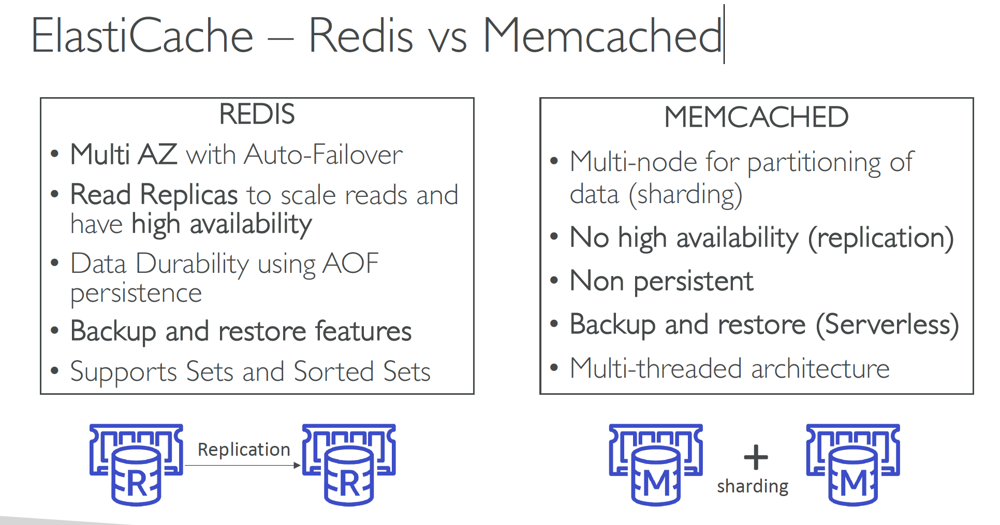
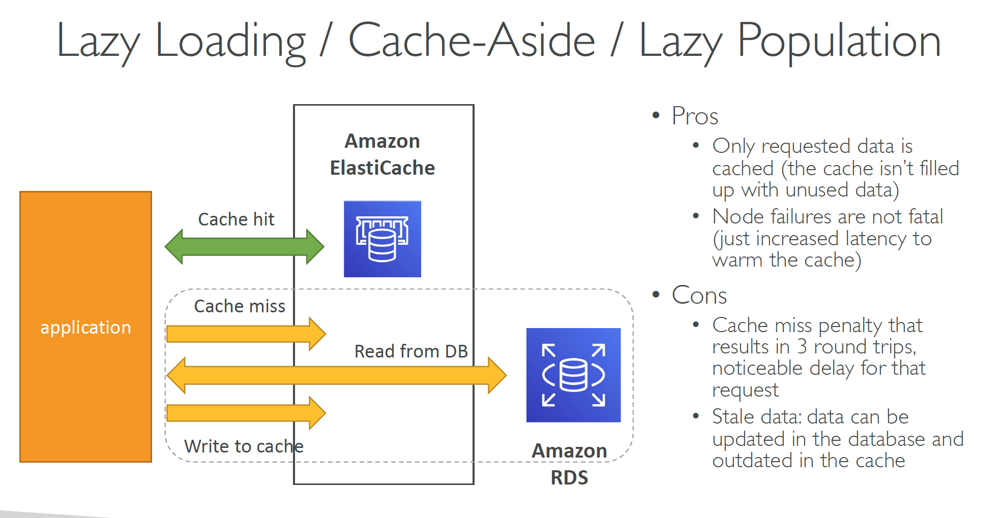
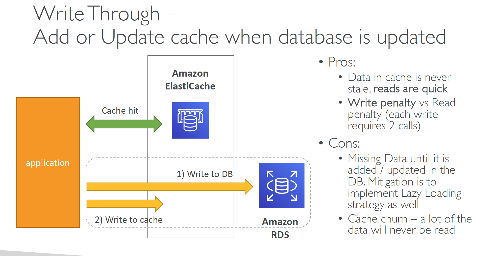

# Section 8: RDS, Aurora, & ElastiCache
## Amazon RDS
__RDS Read Replicas – Network Cost__  
* In AWS there’s a network cost when data goes from one AZ to another
* _For RDS Read Replicas within the same region, you don’t pay that fee_

__RDS – From Single-AZ to Multi-AZ__  
* Zero downtime operation (no need to stop the DB)
* Just click on “modify” for the database
* The following happens internally:
  - A snapshot is taken
  - A new DB is restored from the snapshot in a new AZ
  - Synchronization is established between the two databases

__Aurora High Availability and Read Scaling__  
* 6 copies of your data across 3 AZ:
  - 4 copies out of 6 needed for writes
  - 3 copies out of 6 need for reads
  - Self healing with peer-to-peer replication
  - Storage is striped across 100s of volumes
* One Aurora Instance takes writes (master)
* Automated failover for master in less than 30 seconds
* Master + up to 15 Aurora Read Replicas serve reads
* _Support for Cross Region Replication_   

__Amazon RDS Proxy__  
* Fully managed database proxy for RDS
* Allows apps to pool and share DB connections established with the database
* _Improving database efficiency by reducing the stress on database resources (e.g., CPU, RAM) and minimize open connections (and timeouts)_
* Serverless, autoscaling, highly available (multi-AZ)
* _Reduced RDS & Aurora failover time by up 66%_
* Supports RDS (MySQL, PostgreSQL, MariaDB, MS SQL Server) and Aurora (MySQL, PostgreSQL)
* No code changes required for most apps
* _Enforce IAM Authentication for DB, and securely store credentials in AWS Secrets Manager_
* _RDS Proxy is never publicly accessible (must be accessed from VPC)_

## Amazon ElastiCache
__ElastiCache – Redis vs Memcached__   
  

__Caching Implementation Considerations__
* Read more at: https://aws.amazon.com/caching/implementationconsiderations/
* Is it safe to cache data? Data may be out of date, eventually consistent
* Is caching effective for that data?
  - Pattern: data changing slowly, few keys are frequently needed
  - Anti patterns: data changing rapidly, all large key space frequently needed
* Is data structured well for caching?
  - example: key value caching, or caching of aggregations results
* Which caching design pattern is the most appropriate?

__Caching strategy - Lazy Loading (aka Cache-Aside, Lazy Population)__  


__Lazy Loading Pseudo Code__  
```python
def get_user(user_id):
  record = cache.get(user_id)

  if record is None:
    record = db.query("Select * from users where id = ?", user_id)

    cache.set(user_id, record)
    return record
  else:
    return record

user = get_user(17)
```

__Caching strategy - Write Through__  
* Add or Update cache when database is updated


__Write-Through Python Pseudo Code__  
```python
def save_user(user_id, value):
  record = db.query("update users... where id = ?", user_id, values)
  cache.set(user_id, record)

  return record

user = save_user(17, {"name": "Nate Dogg"})
```

__Cache Evictions and Time-to-live (TTL)__  
* Cache eviction can occur in three ways:
  - You delete the item explicitly in the cache
  - Item is evicted because the memory is full and it’s not recently used, Least Recently User (LRU)
  - You set an item time-to-live (or TTL)
* TTL are helpful for any kind of data:
  - Leaderboards
  - Comments
  - Activity streams
* TTL can range from few seconds to hours or days
* If too many evictions happen due to memory, you should scale up or out

__Final words of wisdom__  
* Lazy Loading / Cache aside is easy to implement and works for many situations as a foundation, especially on the read side
* Write-through is usually combined with Lazy Loading as targeted for the queries or workloads that benefit from this optimization
* Setting a TTL is usually not a bad idea, except when you’re using Write-through. Set it to a sensible value for your application
* Only cache the data that makes sense (user profiles, blogs, etc…)
* Quote: There are only two hard things in Computer Science: cache invalidation and naming things

### Amazon MemoryDB for Redis
* Redis-compatible, _durable, in-memory database service_
* _Ultra-fast performance with over 160 millions requests/second_
* Durable in-memory data storage with Multi-AZ transactional log
* Scale seamlessly from 10s GBs to 100s TBs of storage
* Use cases: web and mobile apps, online gaming, media streaming, …
